#  Command line (2:45)

### Learning Objectives

- Use the most common commands to navigate and modify files / directories via the terminal window.
- Initialize a local Git repository and push/pull changes to a remote Git repository.
- Run basic JavaScript script on the command line using Node.

### Agenda

| Timing | Topic |
| --- | --- |
| 10 min | Recap: JavaScript & Web Technology |
| 20 min | Introduction to the Terminal |
| 20 min | Terminal Codealong |
| 30 min | Introduction to Git/GitHub |
| 5 min  | Break |
| 30 min | Git/GitHub Exercise |
| 20 min | Intro to Node and Command Line JS |
| 5 min  | Break |
| 30 min | Command Line JS |
| 10 min | Final Questions & Exit Tickets |

### Preparation
*Before this lesson, students should already be able to:*

- Describe JavaScript, its role and uses.
- Installing and configuring Node.js, npm, Git, and other command line tools.
- Think programmatically.
- Using HTML and CSS to create static Web pages.

>Note: In the last class, students set their computers up with command line tools like Git and Node, and they worked on a pseudocode exercise. Check to make sure everyone understands the materials covered in the last class and has their command line utilities installed and configured.

---
<a name="opening"></a>
## JS & Web Tech (10 min)

### What Can JavaScript Do?

* JavaScript is used mostly to add interactive elements like animations, buttons, and user input forms to the front-end. Increasingly, however, it is also being used to interact with APIs and databases and to perform back-end tasks.
* JavaScript has very few steps to run. You can add Javascript directly to HTML and it will run in your browser. You can also run Javascript in node.js by giving it a file containing your code.
* JavaScript works on users’ computers even when they are offline.
* JavaScript allows you to create highly responsive interfaces that improve the user experience and provide dynamic functionality, without the need to wait for the server to react and show another page.
* JavaScript can load content into the document if and when the user needs it, without the need to reload the entire page. This is commonly referred to as Ajax.
* JavaScript can determine your browser’s functional limitations and react accordingly. This is referred to as principles of _unobtrusive JavaScript_, or _progressive enhancement_.
* JavaScript can power website backends, scripts, and even physical devices thanks to node.js

Citation: [W3C](https://www.w3.org/community/Webed/wiki/What_can_you_do_with_JavaScript)

---
<a name="codealong1"></a>

## Introduction to the Terminal (20 min)


We learned how to execute some scripts on the command line during Installfest. You will soon find that the command line is the heart of your operating system. Almost anything you can do from a GUI (Graphical User Interface), you can also do from the command line, but FASTER! We'll learn how to navigate computer files and folders using the terminal; this will help us begin pushing our projects to GitHub.

The program that runs in the terminal is called BASH, which stands for Bourne-again shell. This is a play on words referring to an older program called the Bourne shell (sh), similar to how C++ means "1 better than C". Bash is a program that we can enter commands into and get a response from.

Fun fact: in 2014, a bug was discovered in BASH that dated back to 1989 called Shellshock. It allowed attackers to create botnets (army of compromised computers) for spamming and attacking other sites. The bug was so important that it got its own logo.


### Anatomy of the Terminal

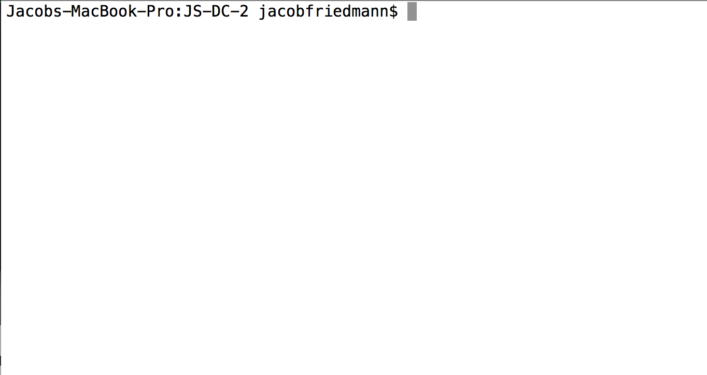

#### Host (computer) name

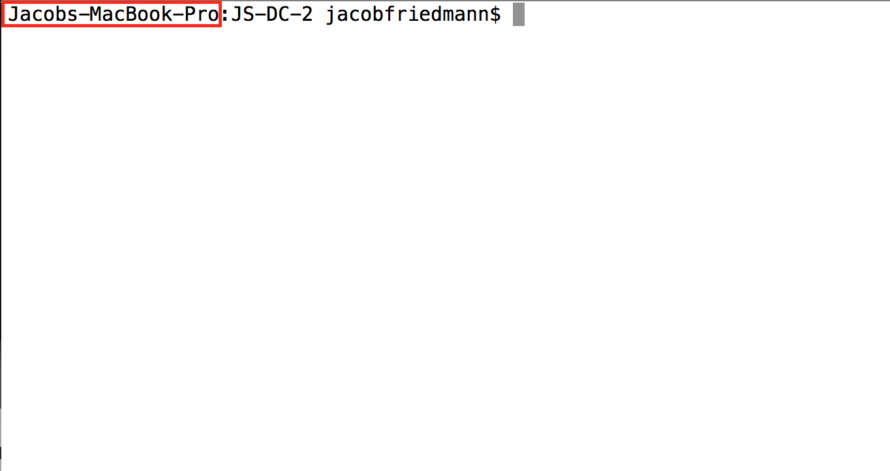

#### Working Directory (current folder)

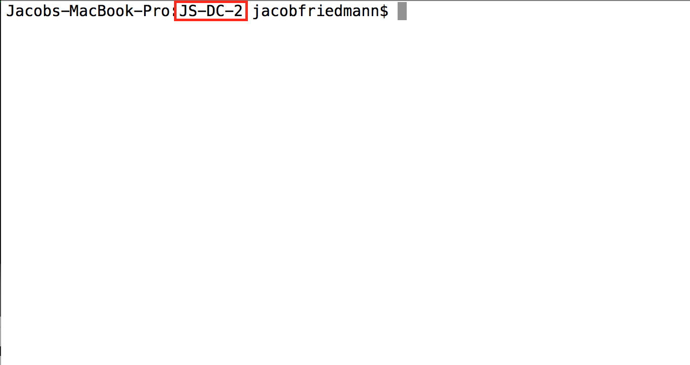

#### Username

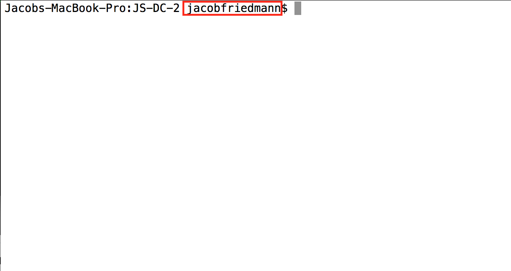

#### Bash Prompt

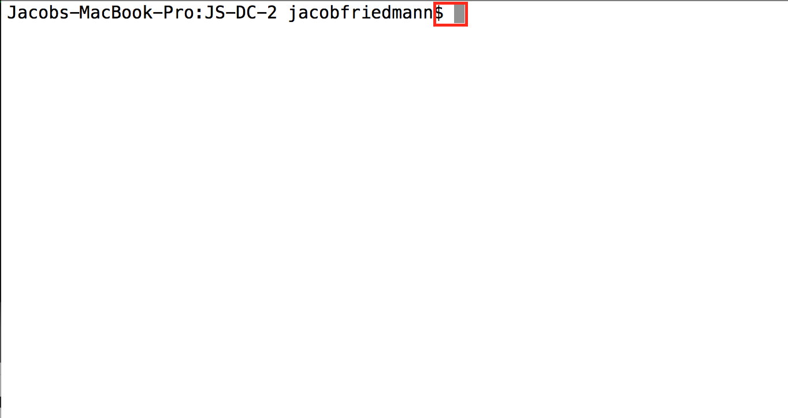

#### Command (program)

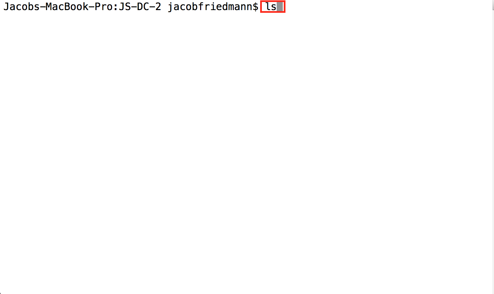

#### Argument (input)

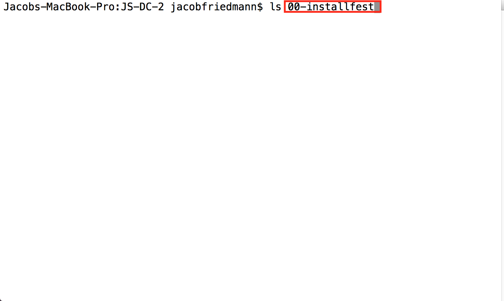

#### Options

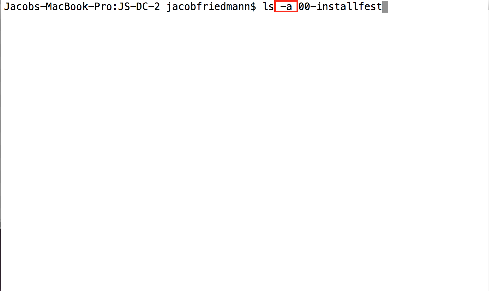

#### Output

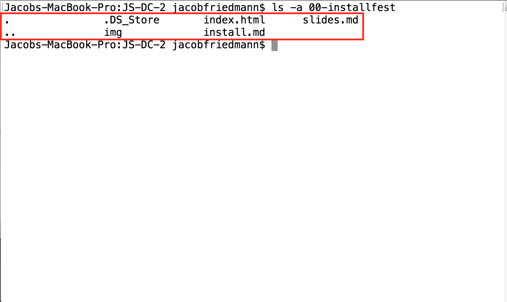

### Command Line Basics

Here are some important UNIX commands to know as you're working on the terminal.

| Command | Description | Command | Description |
| --- | --- | --- | --- |
| `ls` | **L**i**s**t the contents of the directory | `subl` | Open sublime text|
| `cd` | **C**hange **d**irectories| `pwd`| **P**rint **w**orking **d**irectory |
| `mkdir` | **M**a**k**e **dir**ectory | `say`| Make your computer talk |
| `rmdir` | **R**e**m**ove empty **dir**ectories  | `open`| Open a particular file in their default application |
| `rm` | **R**e**m**ove files or directories | `man`  | Show the manual for a command |
| `touch` | Create an empty file | `cat`| Show the contents of a file |
| `echo` | Return a string |  `clear` | Clear the terminal  |

### Folder navigation

- `cd myFolder` go into myFolder
- `cd ../` go up one folder/directory
- `cd ..` shorthand for `cd ../`
- `cd ~/` go to home folder/directory
- `cd` shorthand for `cd ~/`

### Folder navigation

- `./` current directory
- `../` up one directory
- `~/` home directory

## Command Line Codealong (20 min)

**For Macs**:
  * Open the "Terminal" app (Applications > Utilities > Terminal)

**For Windows**:
  * Open the "Git BASH" application

**Get familiar with the basic commands on the terminal!**

1.  Navigate to your Documents Folder from your Root Directory. ```cd ~``` and then ```cd Documents```

2. Create a directory named DCJS2.  ```mkdir DCJS2```

3. Change into this directory. ```cd DCJS2```

4. Create a file named "index.js" using the touch command. ```touch index.js```

5. Demonstrate how to open "index.js" in Sublime Text from the terminal. ```subl```

6. Have students set up Sublime for their working environment. (Show them the open files side bar.)

7. Add some comments into the file.

8. Create an empty directory within the DCJS2 folder and remove it. ```mkdir test_folder ``` and ```rmdir test_folder ```

>Note: Be sure to explain each command while students code along. Switch back to the finder often, so students can make the connection between how the GUI and CLI function.

---

<a name="codealong2"></a>
## Introduction to Git/GitHub (30 min)

### What is Git?


Git is a tool that:
* Developed in the late 70s by same group of developers who made bash
* Primarily stores code, but can also store files, like Dropbox or Google Drive
* Maintains each file’s history, including all document changes (like Apple's Time Machine software)
* Is now commonplace in any company that employs engineers

### Why is *Git* So Popular with Developers?

* Because Git stores a history of the code, it allows developers to “go back in time” if something breaks
* Facilitates collaboration, prevents developers from stepping on one another's toes
* Git tracks changes so you can see who worked on what

### What is GitHub?


GitHub is a web app/platform that:
* Facilitates the sharing and managing of code, making it easy for multiple engineers to collaborate on the same project.
* Hosts files on the Web so you can share the finished product with other people

We setup our GitHub account and _SSH Key_ in the last lesson.

### Why is *GitHub* So Popular with Developers?

* Much like Dropbox or Google Drive lets multiple people collaborate on the same document; GitHub allows this for code.
* GitHub allows team members to provide feedback on the code, which potentially increases code quality
* Has project management features built in: issue tracking, delegation, etc

### Fearlessness in making changes

In developing software, we often want to experiment in adding a feature or refactoring (rewriting) existing code. Because git makes it easy to go back to a known good state, we can experiment without worrying that we'll be unable to undo the experimental work.

### What does the GitHub workflow look like?

GitHub's collaborative process can work many different ways, but this is the most common:

1. Each GitHub project has a Git _repository_, or _repo_. Engineers joining a team start by "cloning" the repo. That is, they copy the Git repo from GitHub's cloud and save it in a local folder.
2. As engineers work on a project, they "add" and "commit" their changes. This establishes a saved version of a project and creates a history of the previous iteration. With these saved versions, engineers are able to revert to an earlier version if an issue arises that cannot be fixed.
3. Engineers then "push" commits from their computer to GitHub.
4. If multiple engineers are working on a project, other engineers can review the committed code and provide feedback. For this class, the instructors will be reviewing and providing feedback on your code.

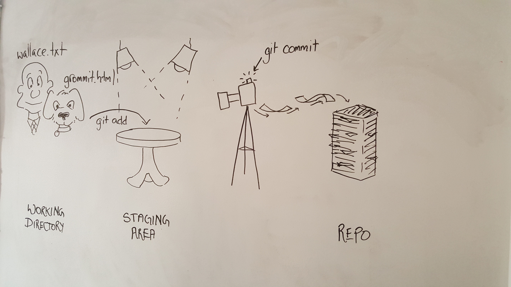

### Git/GitHub Vocabulary

* **Git** - A version control program that saves the state of your project's files and folders; It takes a "snapshot" of what all your files look like at that moment and stores a reference to that "snapshot".

>Note: You may want to compare Git to an organizational backup tool used to save and organize work; be mindful of your students' experience and try not to use too much technical vocabulary.

* **Repository** - A central location in which data—typically project-related—is stored and managed
* **Clone** - To download data from the cloud to your local machine (laptop, computer, etc.)
* **Add** - add files to the stage, in preparation to commit
* **Stage** - Where we put files that we want to commit
* **Commit** - To save a version of your project to Git
* **Push** - Send commits from your computer to GitHub
* **Pull** - Receive commits from GitHub on your computer

>Note: We suggest you draw a diagram and explain what happens when you push/pull and stage a commit. Make sure students understand that changes first need to be added and then committed before they can be pushed. Remember to explain the differences between your local working repository vs. what is on GitHub. And don’t forget to review the vocabulary!

## Break (5min)

## GitHub Exercise

In this codealong, students will create their first GitHub repository and push to it.

**Creating and pushing to your first repository**

#### Together

1. Create the working directory
- `cd ~/Documents/DCJS2`
- `git init` creates a git repo inside current working directory
2. Add files to the staging area
- `git add .` adds changes from the working directory to the staging area
- or `git add <filename>` adds changes to filenames specified from the working directory to the staging area
3. Commit files in the staging area to the repo
- `git commit -m "commit message"` adds changes in staging area to the repository
4. See changes
- `git log` shows list of commits in reverse chronological order
5. Connect our "local" repository to the GitHub "remote" repository
- `git remote add origin git@github.com:<username>/<reponame>.git` connect to remote repository
- `git push -u origin master` push code to our repository for the first time

#### On Your Own

6. Make some changes to the repository
7. Add the changes to the stage
- `git add .`
8. Commit the new changes
- `git commit -m "commit message"`
9. Push the new changes to GitHub
- `git push`
10. Go see your changes on GitHub!

_Look at the `git status` often to see what is happening_

>Note: The instructional team should walk the room and help any students who get stuck during this codealong. This will be many students’ first time using the terminal for an extended period, so proceed slowly, make sure they understand their tasks, and take time to explain anything that’s not clear.

### Looking at a Collaborative Workflow

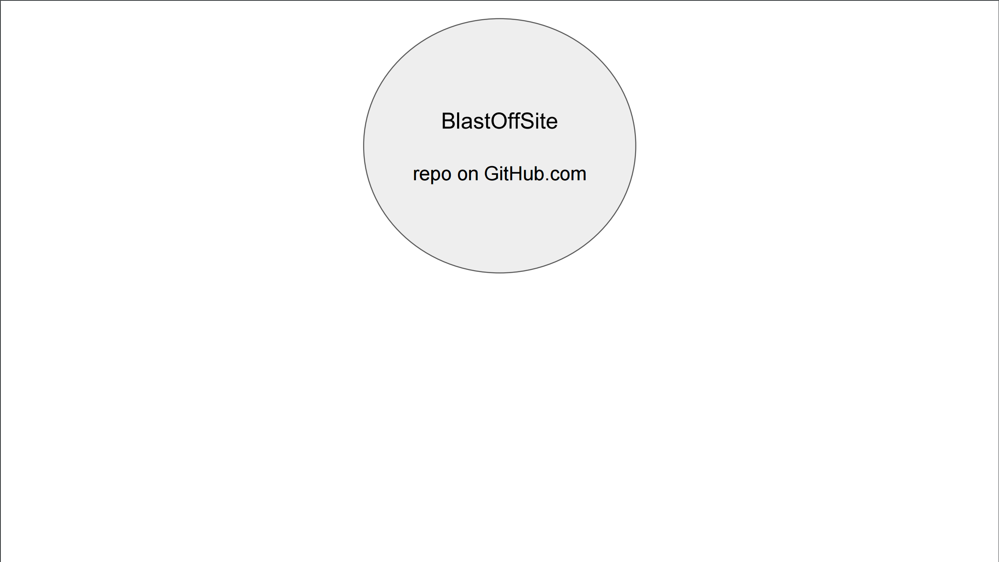

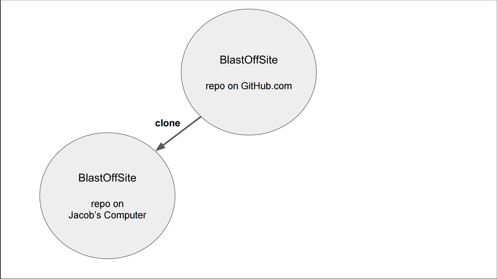

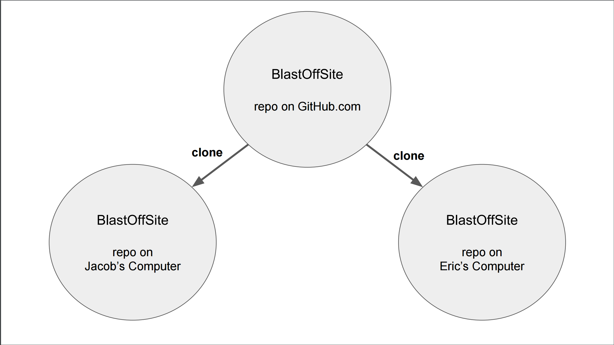

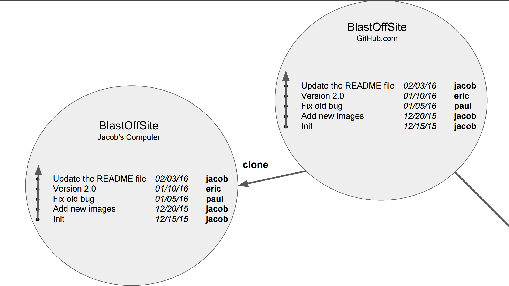

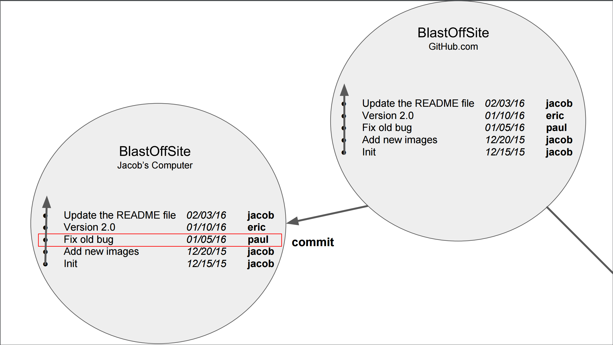

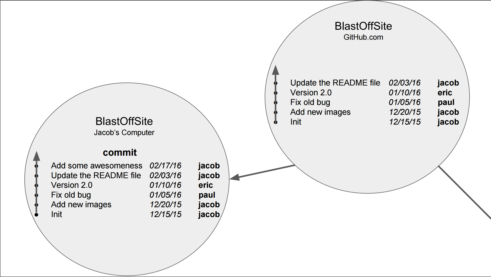

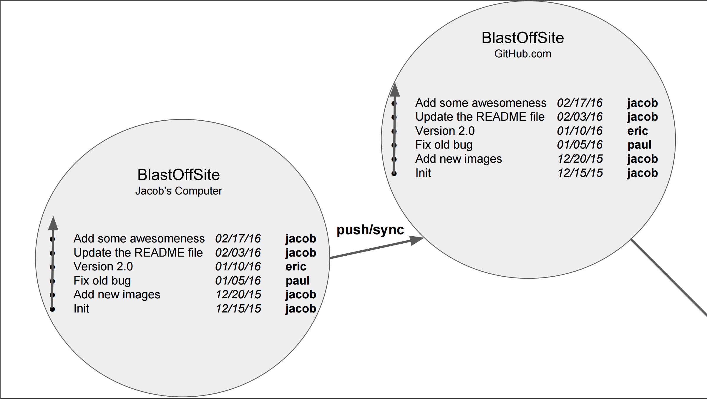

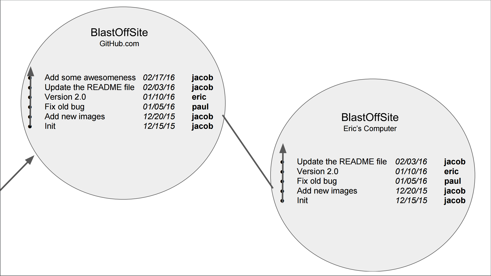

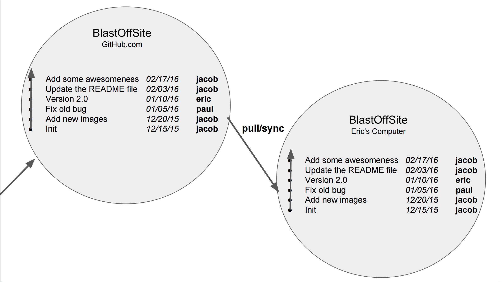

---

<a name="codealong3"></a>
## Intro Node.js and Command Line JS (20min)

> Note: Students should be made aware that we will be using Node during Unit 1 so we can run JavaScript on the command line. This will allow us to learn the fundamentals of programming and the syntax of JavaScript without the distractions of the browser.
We will be using node.js to interpret JS code in the class. Here's a bit more about Node.js.

The makers of Node.js made JavaScript (which normally runs only in the browser) available on the server side (and on your computer!). This allows you to build fast, scalable APIs and sites in JavaScript. JavaScript is already immensely popular; being able to use it on the back-end adds the option of using a single programming language throughout an entire full-stack application.

All this is helpful to engineers because it results in less context switching. Switching between JavaScript, HTML, CSS, and a back-end language (Ruby, Python, PHP, Java, etc.) is time consuming. Using a single language increases efficiency by cutting out all the back and forth.

Node takes away all the parts of JavaScript that are specific to a browser (i.e. interacting with a webpage). However, it uses something called V8, which is the same JavaScript engine used by Chrome.

## Executing a JS program: Codealong (30min)

Starting next class, we'll be creating our own JavaScript files and building out from it. Before we dive in, though, we need to explore the power of the terminal and run JavaScript inside of it.

The terminal is to a programmer what a Swiss Army knife is to a survivalist. It’s a multi-faceted tool that we will always be using to move our projects forward. And, for now, it helps us focus our learning. The computer has always had a text-only interface. Some of you may remember DOS or the early text-only games before complex graphical interfaces. The terminal is a tool from that era that professional developers still use every day.

> **Note:** The following exercise uses basic data types (variables and strings) unexperienced programming students will likely be unfamiliar with. We recommend that you quickly explain these data types as you lead this codealong and let students know we will be explaining these concepts in greater depth next class.

### Part 1: Write and execute some code in a file!

#### Starting Node

In your working directory, start the Node console by typing in ```node```


#### console.log

`console.log` allows us to print things out for inspections, as developers

Let's start off with a classic programming exercise, printing 'Hello World'.

```javascript
console.log('Hello World')
```

You should see Hello World printed. Underneath you will see that it outputs `undefined`. This means that after it has completed the output, there is no further value to return. We just wrote our first bit of Node / JavaScript!

#### var

Variables are containers that allow us to store values

Now we can take it to the next level. Let's drop in some variables:

```javascript
var x = 5;
var y = 2;
```

#### Inpect Our variables

We can also print these variables to our console by typing ```console.log(x)```. We do not include quotes around variables like we do with 'Hello World'.

  > Note: Ask the class why this is the case and make sure they understand the difference between logging variables and strings as a precursor for the next lesson on datatypes. Students frequently get hung up on logging variables with quotes and strings without quotes.

### Part 2: Let's do some basic math!

1. What happens if you do:

  `x + y`

  or

  `y * 4`

2. We can even update the variable like this:

  `x = 9`

3. Now if we add x and y together we get a different result.

  `x + y`

4. While this is only the tip of the iceberg, it starts to lay the foundation for us in terms of what we will be able to accomplish in the near future.

  To exit the console hit CTRL + c + c.

### Part 3: Create and run a JavaScript file and commit it to your repo

1. `cd` into your DCJS2 repo if not already there

2. `subl .` to open the repo in Sublime

3. Add some JavaScript to the index.js file and save the file (be sure to use `console.log`!)

4. Run the program `node index.js`

5. Add the changes to the stage `git add .`

6. Commit your changes `git commit -m "message"`

7. Push changes to GitHub `git push`

---
<a name="conclusion"></a>
## Conclusion (10 min)

#### Review

Make sure the lesson objectives have been met.

* Understand what GitHub does and why we'll be using it.
* Understand how we will be using Node in the class.

#### The Developer Mentality

Here are some tips that you'll want to keep in mind as you continue coding!

  * Choose the right OS, editors and tools for your projects. Remember to do your research.
  * Leverage the online community's vast libraries and documentation.
  * Be efficient: Use the keyboard as much as possible instead of the mouse.
  * If you find yourself doing the same thing repeatedly, automate it.

#### Further Resources

* [iTerm2](http://iterm2.com/)
* [Review Git](https://www.codeschool.com/courses/try-git)
