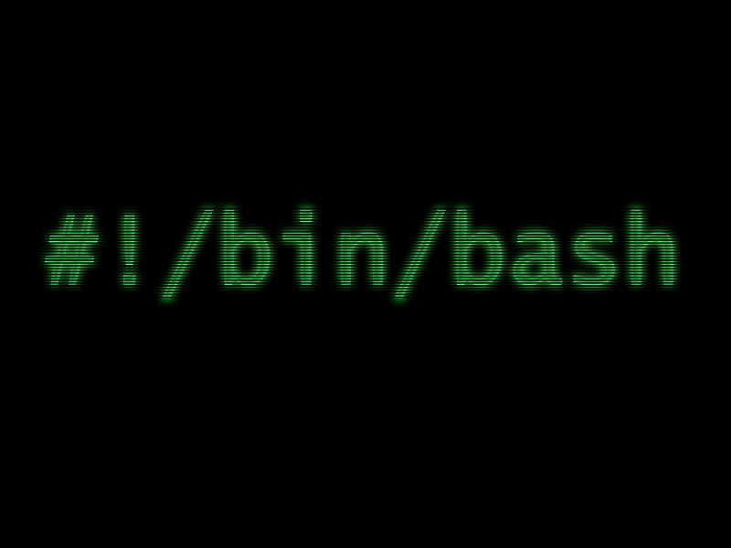
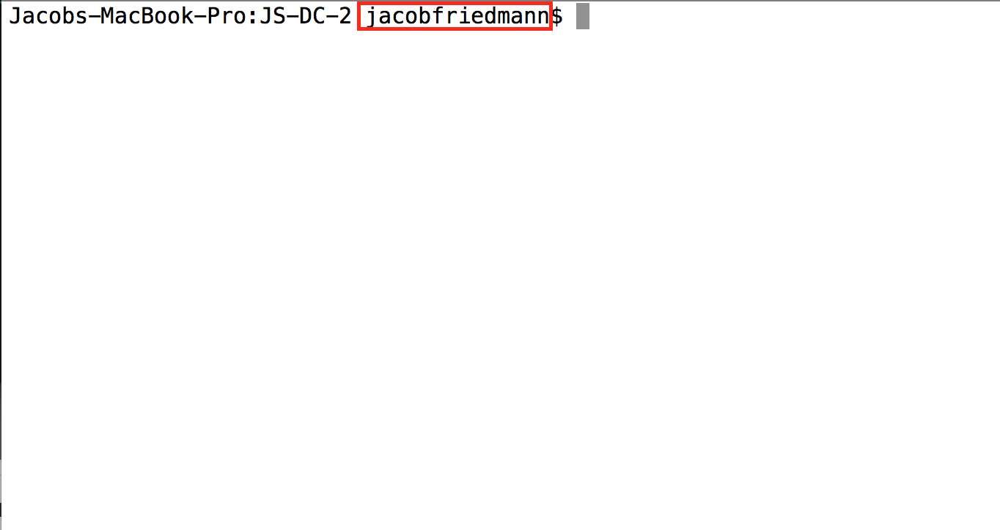
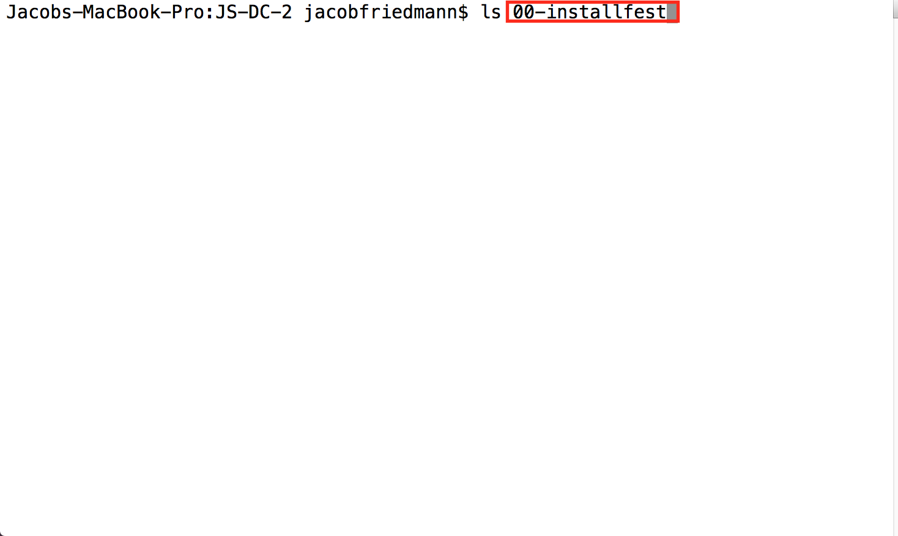
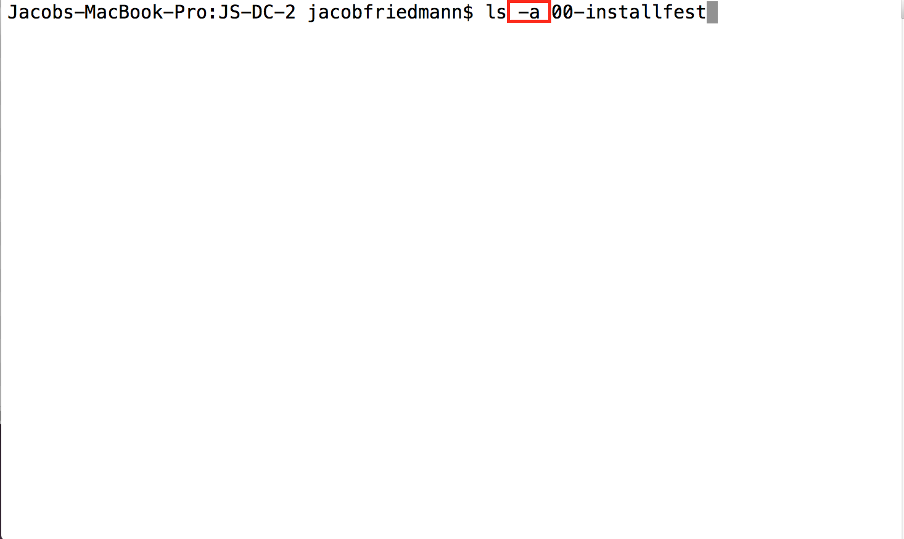
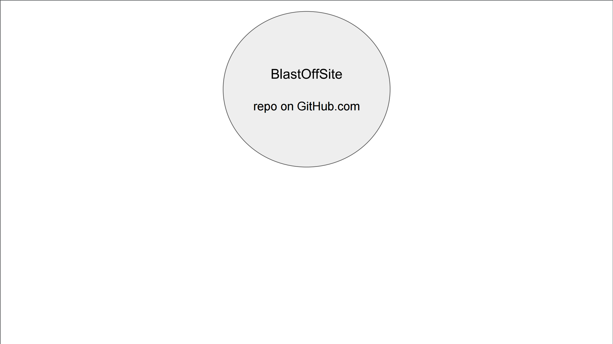
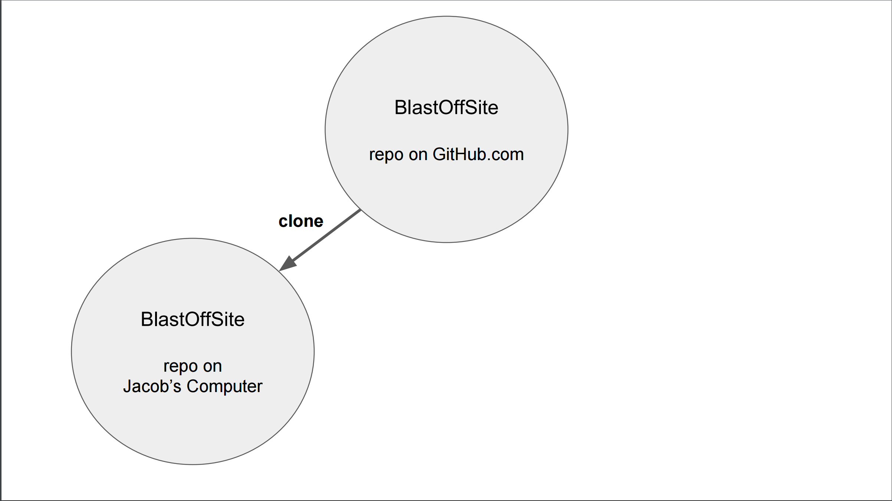
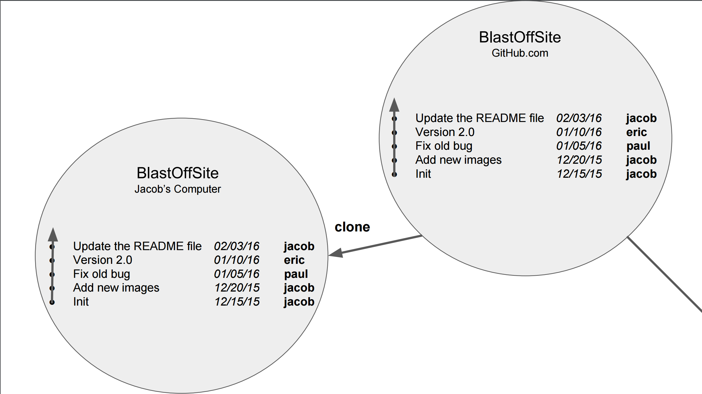

### Class 01: Command Line JS

- Use the most common commands to navigate and modify files / directories via the terminal window.
- Initialize a local Git repository and push/pull changes to a remote Git repository.
- Run basic JavaScript script on the command line using Node.

---

### Agenda

| Timing | Topic |
| --- | --- |
| 10 min | Recap: JavaScript & Web Technology |
| 20 min | Introduction to the Terminal |
| 20 min | Terminal Codealong |
| 30 min | Introduction to Git/GitHub |
| 5 min  | Break |
| 30 min | Git/GitHub Exercise |
| 20 min | Intro to Node and Command Line JS |
| 5 min  | Break |
| 30 min | Command Line JS |
| 10 min | Final Questions & Exit Tickets |

---

## Recap

Questions?

Note:
- Is everyone set up?
- Who are you people again?

--

### JS is important because it is the language of the web

- Only language that runs in the browser

--

### JS is interesting because it is powerful

- Can solve any computable problem
- High level of abstraction
- Flexible paradigm: Object Oriented Programming, Functional Programming
- Can now run in outside of the browser

--

### [http://githut.info/](http://githut.info/)

--

### [Stack Overflow Developer Survey](http://stackoverflow.com/research/developer-survey-2016#most-popular-technologies-per-occupation)

---

## Introduction to the Terminal

--

### Terminal allows you to interact with your computer faster (and look cool)

--

### Terminal === Command Line === Console

Essentially, different names for the same thing

--

### Unix

Family of Operating Systems, including all Linux systems and OS X

--

### Shell

A generic name for the primary program that runs inside a terminal

--

### Bash



Bourne-again shell

Note:

- Play on words referring to an older program called the Bourne shell (sh)
- Similar to how C++ means "1 better than C"

--

### Shellshock


Note:

Fun fact: in 2014, a bug was discovered in BASH that dated back to 1989 called Shellshock. It allowed attackers to create botnets (army of compromised computers) for spamming and attacking other sites. The bug was so important that it got its own logo.

--

### Anatomy of the Terminal


--

#### Host (computer) name


--

#### Working Directory (current folder)


--

#### Username



--

#### Bash Prompt


--

#### Command (program)


--

#### Argument (input)



--

#### Options



--

#### Output


--

### (UNIX) Command Line Basics

| Command | Description |
| --- | --- |
| **`ls`** | **L**i**s**t the contents of the directory |
| **`cd`** | **C**hange **d**irectories|
| **`mkdir`** | **M**a**k**e **dir**ectory |
| `rmdir` | **R**e**m**ove empty **dir**ectories  |
| `rm` | **R**e**m**ove files or directories |
| `touch` | Create an empty file |
| `echo` | Return a string |

--

| Command | Description |
| --- | --- |
| `subl` | Open sublime text |
| **`pwd`**| **P**rint **w**orking **d**irectory |
| `say`| Make your computer talk |
| `open`| Open a file in default application |
| **`man`**  | Show the **man**ual for a command |
| `cat` | Show the contents of a file |
| `clear` | Clear the terminal |

--

### Folder navigation

| Command | Description |
| --- | --- |
| `cd myFolder` | go into myFolder |
| `cd ../`  | go up one folder/directory |
| `cd ..` | shorthand for `cd ../` |
| `cd ~/` | go to home folder/directory |
| `cd` | shorthand for `cd ~/` |

--

### Folder navigation

| Path | Description |
| --- | --- |
| `./` | current directory |
| `../` | up one directory |
| `~/` | home directory |

---

## Command Line Codealong

--

**For Macs**:
  * Open the "Terminal" app (Applications > Utilities > Terminal)

**For Windows**:
  * Open the "Git BASH" application

--

### Setup Sublime

**For Macs**:

`ln -s "/Applications/Sublime Text.app/Contents/SharedSupport/bin/subl" /usr/local/bin/subl`

**For Windows**:

[http://stackoverflow.com/questions/32282847/opening-sublime-text-from-windows-git-bash](Windows)

--

**Get familiar with the basic commands on the terminal!**

1.  Navigate to your Documents Folder from your Root Directory. ```cd ~``` and then ```cd Documents```

2. Create a directory named DCJS2.  ```mkdir DCJS2```

3. Change into this directory. ```cd DCJS2```

4. Create a file named "index.js" using the touch command. ```touch index.js```

--

5. Open "index.js" in Sublime Text from the terminal. ```subl```

6. Add some comments into the file and save it.

7. Look at the file `ls`.

8. Create an empty directory within the DCJS2 folder and remove it. ```mkdir test_folder ``` and ```rmdir test_folder ```

---

## Introduction to Git/GitHub

--

### What is Git?


Git is a tool that:
* Developed in the late 70s by same group of developers who made bash
* Primarily stores code, but can also store files, like Dropbox or Google Drive
* Maintains each file’s history (like Apple's Time Machine software)
* Is now commonplace in any company that employs engineers

--

### Why is *Git* So Popular with Developers?

* Because Git stores a history of the code, it allows developers to “go back in time” if something breaks
* Facilitates collaboration, prevents developers from stepping on one another's toes
* Git tracks changes so you can see who worked on what

--

### What is GitHub?


GitHub is a web app/platform that:
* Facilitates the sharing and managing of code, making it easy for multiple engineers to collaborate on the same project.
* Hosts files on the Web so you can share the finished product with other people

--

### Why is *GitHub* So Popular with Developers?

* Much like Dropbox or Google Drive lets multiple people collaborate on the same document; GitHub allows this for code.
* GitHub allows team members to provide feedback on the code, which potentially increases code quality
* Has project management features built in: issue tracking, delegation, etc

--

### Fearlessness in making changes

In developing software, we often want to experiment in adding a feature or refactoring (rewriting) existing code. Because git makes it easy to go back to a known good state, we can experiment without worrying that we'll be unable to undo the experimental work.

--

### Git vs. GitHub

**Git** is Version Control Software.

**GitHub** is a website and platform for utilizing git in a collaborative way.

--

### What does using GitHub look like?

1. Each project has a Git _repository_, or _repo_. First, you have to create a repository, either on your computer or in GitHub.
2. As you work on a project, you "add" and "commit" your changes. This establishes a saved version of a project and creates a history of the previous iteration. With these saved versions, engineers are able to revert to an earlier version if an issue arises that cannot be fixed.
3. Engineers then "push" commits from their computer to GitHub.
4. If multiple engineers are working on a project, other engineers can review the committed code and provide feedback.
5. You can also "pull" changes from GitHub from other developers.

Note:


--

### Git/GitHub Vocabulary

* **Git** - A version control program that saves the state of your project's files and folders; It takes a "snapshot" of what all your files look like at that moment and stores a reference to that "snapshot".
* **Repository** - A central location in which data—typically project-related—is stored and managed
* **Clone** - To download data from the cloud to your local machine (laptop, computer, etc.)
* **Add** - add files to the stage, in preparation to commit
* **Stage** - Where we put files that we want to commit
* **Commit** - To save a version of your project to Git
* **Push** - Send commits from your computer to GitHub
* **Pull** - Receive commits from GitHub on your computer

--

| Command | Description |
| --- | --- |
| `git init` | Create new repository |
| `git status`| See the status of files in your repo |
| `git log`| Look a list of commits |
| `git add`| Add files to the "stage" for commit |
| `git commit`  | Create a "commit" snapshot of your project |
| `git push` | Push updates to GitHub |
| `git pull` | Pull updates from GitHub |

---

## Break (5min)

---

## GitHub Exercise

--

**Creating and pushing to your first repository**

#### Together

1. Create the working directory
    - `cd ~/Documents/DCJS2`
    - `git init` creates a git repo inside current working directory
2. Add files to the staging area
    - `git add .` adds changes from the working directory to the staging area
    - or `git add <filename>` adds changes to filenames specified from the working directory to the staging area
3. Commit files in the staging area to the repo
    - `git commit -m "commit message"` adds changes in staging area to the repository

--

4. See changes
    - `git log` shows list of commits in reverse chronological order
5. Connect our "local" repository to the GitHub "remote" repository
    - `git remote add origin git@github.com:<username>/<reponame>.git` connect to remote repository
    - `git push -u origin master` push code to our repository for the first time

--

#### On Your Own

6. Make some changes to the repository
7. Add the changes to the stage
    - `git add .`
8. Commit the new changes
    - `git commit -m "commit message"`
9. Push the new changes to GitHub
    - `git push`
10. Go see your changes on GitHub!

Note:

_Look at the `git status` often to see what is happening_

--

### Looking at a Collaborative Workflow

--



--



--


--



--


--


--


--


--


---

## Intro Node.js and Command Line JS

--


### Node.js

Note:

- Created in 2009 by Ryan Dahl to allow developers to write JavaScript on the backend (replacing languages like Ruby, PHP, Java, etc)
- When he first introduced it at JSConf, he received a standing ovation

--


### Joyent

Note:

- Ryan was hired by Joyent and the project, still open-source, was taken under their stewardship

--


### io.js

Note:
- In 2014, there was a disagreement within the open source community that caused a rift in the project
- from here io.js split and the projects were maintained separately

--

### Reconciliation

Note:

- A little less than a year later, the two projects realized they were better together than apart, reconciled their differences and merged back together

--

### How is it different from JS in the browser?

- No browser specific functionality
- Same JS Engine as Chrome

--

### What is it good for?

- Creating a backend server for a web application
- Running a script to do data analysis (like python)
- File management
- Making command line programs (tools, games, etc)

--

### Ways to run node

1. Interactive command line
2. Run a file

---

## Executing a JS program: Codealong

--

### Part 1: Let's do math!

--

#### Starting Node

In your working directory, start the Node console by typing in ```node```

--

#### Addition

`1 + 1`

--

#### Subtraction

`1 - 1`

--

#### Multiplication

`1 * 2`

--

#### Division

`10 / 5`

--

#### Modulus

`8 % 2`

--

### Variables

Variables are containers that allow us to store values

Now we can take it to the next level. Let's drop in some variables:

```javascript
var x = 5;
var y = 2;
```

--

### Variables

We can tell our program to remember values for us to use later on.

The action of saving a value to a variable is called assignment.

--

### Variable Declaration

Telling our program that we wish to make a variable. We choose the name.

```javascript
var a;
```

--

### Variable Assignment

```javascript
a = 13;
```

--

### Variable Assignment and Declaration

```javascript
// Do assignment and declaration separately
var a;
a = 13;

// Do assignment and declaration at the same time
var b = a + 2;
```

--

### When to use?
#### Variables

When we need to keep track of something for later use

--

### Part 2: Let's use variables!

--

```javascript
var x = 5;
var y = 2;
```

--

1. What happens if you do:

  `x + y`

  or

  `y * 4`

--

2. We can even update the variable like this:

  `x = 9`

--

3. Now if we add x and y together we get a different result.

  `x + y`

--

4. While this is only the tip of the iceberg, it starts to lay the foundation for us in terms of what we will be able to accomplish in the near future.

  To exit the console hit CTRL + c + c.

--

### console.log

```
console.log('Hello World!');
```

--

### console.log

Logging to the console is how we print things out for our own inspection

--

### Inspecting Variables

console.log(y)

--

### When to use?
#### console.log

- When we are developing a program and need help figuring out what's going on (a.k.a. debugging)
- When we want to print things to the command line

--

### Part 3: Create and run a JavaScript file and commit it to your repo

--

1. `cd` into your DCJS2 repo if not already there

2. `subl .` to open the repo in Sublime

3. Add some JavaScript to the index.js file and save the file
    - Create two variables and store numbers in them
    - Add the two variables together and store the result in a third variable
    - Log the third variable to the console for inspection

4. Run the program `node index.js`

5. Add the changes to the stage `git add .`

6. Commit your changes `git commit -m "message"`

7. Push changes to GitHub `git push`

---

## Assignment 1

* [Try Git](https://www.codeschool.com/courses/try-git)
* [Submit Screenshot to Dropbox](https://www.dropbox.com/request/5qarfNlLPMd0f55cD8RO)
* [Introduction, Eloquent JavaScript](http://eloquentjavascript.net/00_intro.html)
* [Chapter 1, Eloquent JavaScript](http://eloquentjavascript.net/01_values.html)

**Due Monday, June 20**

---

## [Exit Ticket! (Class 2)](http://goo.gl/forms/KzVZ9fuo2YYw5WIB3)

---

# Goodnight :-)
