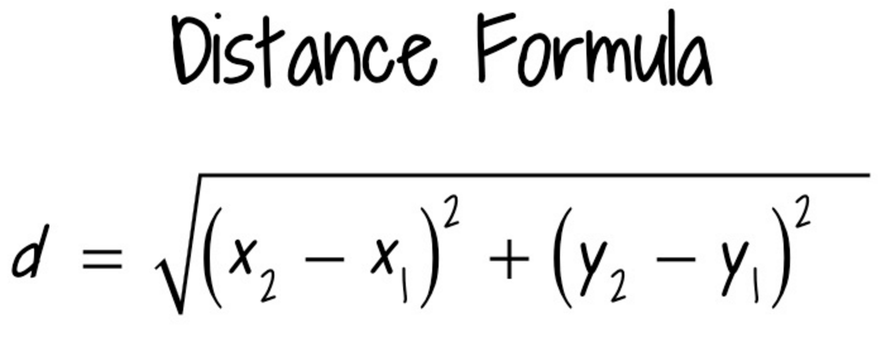
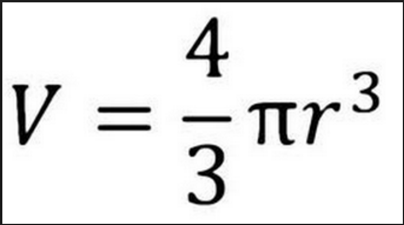

#  Data Types

## Learning Objectives
*After this lesson, students will be able to:*

- Describe the concept of a "data type" and how it relates to variables.
- Declare, assign to, and manipulate data stored in a variable.
- Create arrays and access values in them.

---

## Agenda

| Timing | Topic |
| --- | --- |
| 15 min | Recap: Terminal, Git, Node |
| 15 min | Variables |
| 10 min | What is a Data Type?  |
| 20 min | Data Types |
| 5 min  | Break |
| 30 min | Data Types (Contd) |
| 20 min | Exercise: Data Types |
| 10 min | Intro to Arrays |
| 5 min | Break |
| 10 min | Working with Arrays |
| 20 min | Exercise: Array Basics |
| 20 min | Array Methods |
| 20 min | Exercise: Decoder |
| 5 min | Final Questions and Exit Tickets |

---

## Preparation
*Before this lesson, students should already be able to:*

- Be comfortable navigating between folders on the command line.
- Run JavaScript on the command line using Node.js and use basic variables.

>Last class, we worked on using basic commands in the terminal, writing JavaScript, and working with Git and GitHub. Check with students to make sure that everyone is comfortable with the materials covered in the last class.

>Take a look at some simple keyboard shortcuts to practice: [CLI Shortcuts](https://gist.github.com/alexpchin/01caa027b825d5f98871)

---

## Recap: Terminal, Git, Node (10 min)

---

## Variables (15 min)

Variables are used to store data types in a computer’s memory, so that they can be referenced later.

### Var Keyword

We declare new variables in JavaScript using the [`var`](https://developer.mozilla.org/en-US/docs/Web/JavaScript/Reference/Statements/var "/en/JavaScript/Reference/Statements/var") keyword.

If you declare a variable without assigning a value to it, its type will be `undefined.`s

```javascript
var a;
// undefined
```

Let’s try assigning a value to variable:

```javascript
var name = 47;
// undefined

name
// 47
```

Having made some expressions it becomes evident we may want to store these values.

```javascript
var myNumber = 1;

// or also

var myString = "Greetings y'all!"
```

Best practice: always remember that these variables should always have the `var` keyword and use `camelCase`.

We can also reassign variables:

```javascript
var a = 1;

a = a + 1;

a
// 2
```

### Assignment Operators

Values are assigned using `=`; compound assignment statements, such as `+=` and `-=`, can also be used:

```javascript
var x = 1;
// 1


// Same as x = x + 5;
x += 5
// 6
```

You can use `++` and `--` to increment and decrement by 1, respectively. These can be used as prefix or postfix operators.

To recap, we have discussed two types of values—or, objects—that store data and offer helpful computation functions.

---

## What is a Data Type? (10 min)

Let's jump into today's lesson—data types—where we’ll learn the basics of JavaScript and how to exchange data.

Building an app requires the exchange of data—and it all starts with data types. But what are data types? In computer science and computer programming, a data type is a classification identifying one of various types of data. Using data types, we can determine 1) the possible values for that type; 2) the operations that can be performed on values of that type; 3) the meaning of the data; and 4) the way values of that type can be stored.

You might have already encountered data types. Data types hold many similarities across different languages. JavaScript is called a dynamically typed or untyped language because unlike languages like Java, which is strictly typed, you do not need to tell each variable which type it will contain.

| Data Type | Description | Example |
| --- | --- | --- |
| **Strings** | Single words or sentences surrounded by double or single quotes | `"lots of kittens"`, `'lots of kittens'` |
| **Numbers** | Whole numbers, decimals | `42`, `3.14`, `3.0` |
| **Booleans** | Represents either true or false | `true`, `false` |
| **Undefined** | Variable that has yet to assigned | `undefined` |
| Arrays | Collections of Data | `[ 'Superman', 'Batman', 'Spider-Man' ]` |
| Null | Absence of value | `null` |
| Objects | Coming soon... | `{ name: 'jacob' }` |

We'll now elaborate on Strings, Numbers, Booleans, Null and Undefined now (the others will come later) and explain how they differ in JavaScript, show you how to work with each type, and get some practice using “helper methods” to manipulate this data.

---

## Datatypes (20 min)

For this lesson, we're going to use the terminal and Node to run some basic scripts to understand the types of data we're working with. Open the terminal and type in ```node```.

### Numbers

Numbers are divided into two classes or objects:

* Integers (a.k.a. "whole numbers")

```javascript
 ..., -1,0, 2, 3, 4, 5, ...
```

* Floats (or Decimal numbers)

```javascript
 2.718, 3.14, 0.5, 0.25, etc.
```

All numbers in JavaScript are **"double-precision 64-bit format IEEE 754 values"**. In other words, there's really no such thing as an integer in JavaScript. In this case, you have to be a careful with your arithmetic if you're used to math in other programming languages. Let's take a look at what happens when we do this:

```javascript
0.1 + 0.2
=> 0.30000000000000004
```

In JavaScript, these data points are the same data **type**—which JavaScript calls *Numbers*-so don't be surprised when `typeof` doesn't return 'float' and 'integer.'

#### Arithmetic Operators

We use operators to work with data in JavaScript. The standard [arithmetic operators](https://developer.mozilla.org/en-US/docs/Web/JavaScript/Reference/Operators#Arithmetic_operators)—which you have been learning since grade school—are supported here, including addition, subtraction, division, and so forth. Check it out:

```javascript
1 + 2
// 3

2 - 5
// -3

5 / 2
// 2.5

6 * 2
// 12

10 % 2
// 0
```

#### Special Number Operators

JavaScript is slightly limited regarding the number of operations it allows you to perform. For example, it doesn’t enable you to easily square a number or cube a number. Fortunately, a special `Math` object with some very useful methods is available.

* Taking a number to some `power`? Just use `Math.pow`.

```javascript
// 3^2 becomes
Math.pow(3,2)
// 9
// 2^4 becomes
Math.pow(2,4)
// 16
```

* Taking a square root

```javascript
// √(4) becomes
Math.sqrt(4)
// 2
```

* Need a `random` number? Then use `Math.random`.

```javascript
// The following only returns a random decimal
Math.random()
// 0.229375290430
```

How might we get a number between 0 and 10?

When could random numbers be useful?

* Since Numbers can be **Floats** or **Integers**, we often need to delete remaining decimal places, which can be done using `Math.floor`. We can round up using `Math.ceil`.

```javascript
// Remove the decimal
Math.ceil(3.14)
// 4
Math.floor(3.9999)
// 3
```

#### Numbers: Used for?

- Scores
- Age
- Currency

From d3 open source project, for calculating force during a collision:
```javascript
var data = quad.data, rj = quad.r, r = ri + rj;
if (data) {
  if (data.index > i) {
    var x = xi - data.x - data.vx;
    var y = yi - data.y - data.vy;
    var l = x * x + y * y;
    if (l < r * r) {
      if (x === 0) x = jiggle(), l += x * x;
      if (y === 0) y = jiggle(), l += y * y;
      l = (r - (l = Math.sqrt(l))) / l * strength;
      node.vx += (x *= l) * (r = (rj *= rj) / (ri2 + rj));
      node.vy += (y *= l) * r;
      data.vx -= x * (r = 1 - r);
      data.vy -= y * r;
    }
  }
  return;
}
```

### Strings

We use textual data a lot in applications, called "Strings". Strings are collections of letters and symbols known as *characters*. We use them to deal with words and text in JavaScript. Strings are just another type of **value** in Javascript.

```javascript
"John"
'Jane'
"123"
```

#### Concatenation

When working with Strings, the "+" operator means concatenation. Concatenation is combining Strings
into a larger String.

```javascript
'Hello ' + 'World'
// 'Hello World'

'Jacob ' + 'D ' +'Friedmann'
// 'Hello World'
```

```javascript
var firstName = 'Jacob';
var lastName = 'Friedmann';

var fullName = firstName + ' ' + lastName;
```

If a String is on either side of a "+" sign, it will mean concatenation:

```javascript
'I have ' + 10 + ' cats.'
// 'I have 10 cats.'

20 + '16'
// '2016'
```

#### Empty String

A String with no characters in it.

```javascript
''

'Hello' + '' + '' + '' + ''
// 'Hello'
```

#### Case

We can capitalize or lower case Strings if we need to.

```javascript
'hello'.toUpperCase();
// HELLO

var a = 'wOrLd';
a.toLowerCase();
// world
```

#### Strings: Used for?

- Names
- Content: blog posts, comments, etc
- User input

from places.js open source project, error messages
```javascript
var errors = {
  multiContainers: "Algolia Places: 'container' must point to a single <input> element.",
  badContainer: "Algolia Places: 'container' must point to an <input> element."
};
```

---

## Break (5 min)

---

## Data Types Continued (30 min)

### Booleans

`true` and `false`

Names after George Boole, creator of "boolean algebra", the root of formal logic.

#### Negation operator

`!` in front of a boolean value will negate it (make it opposite).

Read as "not".

```javascript
!true
// false
```

#### Logical Operators

- `&&` (and) operator

Both sides must be true

```javascript
true && true
// true

true && false
// false
```

- `||` (or) operator

One side must be true

```javascript
true || false
// true

false || false
// false
```

We can chain operators

```javascript
true && true && false
// false

false || false || false || true
// true
```

- Today is Tuesday && We are in class
  - true
- Today is Tuesday && !The year is 2020
  - true
- !Today is Tuesday || (The year is 2016 && It is morning)
  - false

#### Booleans: Used for?

- on or off
- is the answer right or wrong?
- settings (enabled or disabled)

from AlgorithmVisualizer open source library, defining settings:
```javascript
editor.setOptions({
  enableBasicAutocompletion: true,
  enableSnippets: true,
  enableLiveAutocompletion: true
});
```

### Undefined

**Undefined** is the value a variable gets before we assign it a value.

```javascript
var a;

a
// undefined
```

We can also assign a value of undefined.

```javascript
var a = 22;

a
// 22

a = undefined;

a
// undefined
```

### Type Conversion

* If you want to turn a number or boolean into a string, you can use a helpful method called `toString`.

```javascript
var a = 1;
a.toString();
// '1'

var b = true;

b.toString();
// 'true'
```

* `parseFloat` and `parseInt` can convert a String into a number

```javascript
parseInt('42');
// 42

parseFloat('3.1415');
// 3.1415
```

#### When will this be useful?

User input is usually in the form of a String, so if we want a numerical value we'll need to convert it.

### `typeof( )`

We don’t yet know what type of data we're working with, so let’s ask the computer. To do this, we can use [`typeof()`](https://developer.mozilla.org/en-US/docs/Web/JavaScript/Reference/Operators/typeof). Let's try it out in the terminal with the following:

```javascript
typeof(37);
// 'number'

typeof(3.1415);
// 'number'

typeof(true);
// 'boolean'

typeof('hello world');
// 'string'
```

`typeof()` returns a string with the type of the operand, or expression of the object you're looking at.

What is `typeof(typeof(3))`?

#### When will this be useful?

If I were to show you the variable `d`, could you tell me what type that variable is? `typeof` can assist
when we don't know the type of a variable when we're writing the code.

JavaScript doesn't mandate that a variable stay the same type. This can be confusing, especially when there are
many developers working on the same thing.

```javascript

var myNumber = 47;

myNumber = 'Haha sucker';

myNumber / 10
// womp womp
```
---

## Exercise: Datatypes (20 min)





---

## Introduction to Arrays (10 min)

You will find that strings and numbers are often not enough for most programming purposes. What is needed are collections of data that we can use efficiently. These are called Arrays.

Arrays are great for:

* Storing data
* Enumerating data (i.e., using an index to find them)
* Quickly reordering data

In essence, arrays compose a data structure that is similar in concept to a list. Each item in an array is called an element, and the collection can contain data of the same or different types. In JavaScript, arrays can dynamically grow and shrink in size.


```javascript
var friends = ['Moe', 'Larry', 'Curly'];
// ['Moe', 'Larry', 'Curly']
```

### Indexes

Index is like an address-it's how we find elements in an array.

Items in an array are stored in sequential order; they are indexed starting at `0` and ending at `length - 1`. JavaScript starts counting at zero, so the first position in the array will be `[0]`, the second position in the array will be `[1]`, and so forth.

```javascript
friends[0];
// 'Moe'

// First friend
var firstFriend = friends[0];
// 'Moe'

// Get the last friend
var lastFriend = friends[2]
// 'Curly'
```

### Length

The "length" of an Array is the number of elements inside of the Array. It will always be one greater than the last index in the array.

```javascript
friends.length
// 3

var lastIndex = friends.length - 1;
var lastFriend = friends[lastIndex];
// 'Curly'
```

We can almost think of a String as an Array of characters:

```javascript
var friend = "bobby bottleservice";
// pick out first character
friend[0]
//=> 'b'
friend.length
```

---

## Break (5min)

---

## Working with Arrays (15 min)

### Length Method

The `length` method works in an interesting way in Javascript. It is always one more than the highest index in the array.

So `array.length` isn't necessarily the number of items in the array. Consider the following:

```javascript
var a = ["dog", "cat", "hen"];
a[100] = "fox";
a.length;
=> 101
```

**Remember**: the length of the array is one more than the highest index.

### Getting Data from an Array

If you query a nonexistent array index, the result will be `undefined`:

```javascript
var a = ["dog", "cat", "hen"];
// undefined

typeof a[90];
// undefined
```

---

## Exercise: Array Basics (20 min)

---

## Array Methods (25 min)

Arrays come with a number of methods. Here's a list of some popular helpers:

> Note: You might want to demonstrate a few of these.

- `a.pop()` - Removes and returns the last item.

- `a.push(item1, ..., itemN)` - Adds one or more items to the end.

- `a.reverse()` - Reverses the array.

- `a.join()` - Concatenates elements in a array together into a string

You will likely not remember _every_ method. Explore the [full documentation for array methods](https://developer.mozilla.org/en-US/docs/Web/JavaScript/Reference/Global_Objects/Array) and other helper methods provided for particular objects.

In this exercise, students will utilize their knowledge of array helper methods in order to decode a secret message.

### `a.pop()`

```javascript
var planets = ['Mercury', 'Venus', 'Earth', 'Mars', 'Jupiter', 'Saturn', 'Uranus', 'Pluto'];

planets.pop();

planets
// ['Mercury', 'Venus', 'Earth', 'Mars', 'Jupiter', 'Saturn', 'Uranus']
```

### `a.push()`

```javascript
planets.push('Planet 9');

planets
// ['Mercury', 'Venus', 'Earth', 'Mars', 'Jupiter', 'Saturn', 'Uranus', 'Planet 9']
```

### `a.reverse()`

```javascript
var name = ['b', 'o', 'c', 'a', 'J'];

name.reverse();
// ['J', 'a', 'c', 'o', 'b']
```

### `a.join()`

```javascript
name.join();
// 'J,a,c,o,b'

name.join('');
// 'Jacob'
```

---

## Exercise: Decoder (20 min)

---

## Conclusion (5 min)

#### Review

Make sure the lesson objectives have been met.

* Describe use cases of different "data types".
* Why is iterating important when working with stored data?

#### Further Resources

* Feel free to read more from [Mozilla](https://developer.mozilla.org/en-US/docs/Web/JavaScript/A_re-introduction_to_JavaScript) about JavaScript fundamentals.
