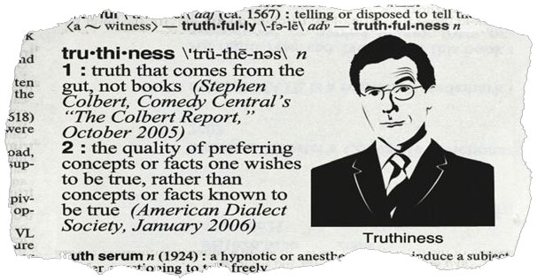

# 
## Conditionals and Loops

- Use if/else conditionals to control program flow based on Boolean (true or false) tests.
- Differentiate among true, false, 'truth-y', and 'false-y'.
- User loops to iterate through Arrays.

---

## Agenda

| Timing | Topic |
| --- | --- |
| 15 min | Recap: Data Types |
| 10 min | Recap: Booleans and Logical Operators |
| 20 min | Comparison Operators |
| 10 min | Intro to Control Flow |
| 15 min | Conditional Statements |
| 20 min | Exercise: Conditionals |

--

| Timing | Topic |
| --- | --- |
| 15 min | Truthiness |
| 10 min | Recap: Arrays |
| 25 min | Exercise: Arrays |
| 20 min | Loops |
| 15 min | Exercise: Loops |
| 5 min | Final Questions & Exit Tickets |

---

## Announcements

Note:
- Parking lot
- Pace, bonus material
- Women in code

---

## Recap: Data Types

| Data Type | Description |
| --- | --- | --- |
| **Strings** | Single words or sentences surrounded by double or single quotes |
| **Numbers** | Whole numbers, decimals |
| **Booleans** | Represents either true or false |
| **Undefined** | Variable that has yet to assigned |
| **Arrays** | Collections of Data |

- What are the potential values?
- What operations can be done?
- How are they used in programs?

---

## Recap: Boolean and Logical Operators

There are two "binary" operators that require two values:

- **AND**, denoted `&&`
- **OR**, denoted `||`

A third "unary" operator requires only one value:

* **NOT**, denoted `!`

--

### && (AND)

The `&&` operator requires both left and right values to be `true` in order to return `true`:

```javascript
true && true
//=> true
```

Any other combination is false.

```javascript
true && false
//=> false

false && false
//=> false
```

--

### || (OR)

The `||` operator requires just one of the left or right values to be `true` in order to return true.

```javascript
true || false
//=> true

false || true
//=> true

false || false
//=> false
```

Only `false || false` will return `false`

--

### ! (NOT)

The `!` takes a value and returns the opposite Boolean value:

```javascript
!true
//=> false
```

---

## Comparison Operators

--

### Inequality

- `>`
- `<`
- `>=`
- `<=`

--

### Inequality

```javascript
10 > 99999
//=> false

15 >= 15
//=> true

12 < "12"
//=> false

'a' >= 'a'
//=> true
```

--

### Equality

- `==`
- `===`
- `!=`
- `!==`

--

#### Double-Equals Equality Operator `==`

```javascript
"dog" == "dog";
//=> true

1 == true;
//=> true
```

--

#### Triple-Equals Equality Operator `===`

```javascript
1 === true;
//=> false

'10' === 10
//=> false

true === true;
//=> true

"hello" === "hello"
//=> true
```

--

#### BEST PRACTICE: Use `===`

--

#### != and !==

```javascript
"hello" !== "world"
// true

4 !== 4
// false

4 !== '4'
// true
```

Note:

There are also `!=` and `!==` operators, which are the negative versions of `==` and `===`. And again, we should always use `!==` and `===`, because they are more precise than `!=` and `==`.

---

## Control Flow

Note:

We've now talked about Data Types and Operators. The next thing we'll talk about on our quest to understand the parts of JavaScript is Control Flow and Control Flow Structures.

--

### What is Control Flow?

Note:

All of the JavaScript we've looked at so far is executed sequentially, line by line. Control Flow Structures can change this and allow our programs to run in a dynamic order based on the conditions under which the program is run.

--

### Control Flow Structures

- **Conditionals**
- **Loops**
- Switch Statements
- Exception Handling
- Async

--

### Code blocks

```javascript
{
    // code here
}
```

Note:

Control flow structures typically use curly braces to group lines of code, we calls
these "blocks"

---

## Conditional Statements

Note:

Conditional statements enable us to essentially decide which blocks of code to execute and which to skip, based on the results of tests that we run. JavaScript supports two conditional statements: `if`...`else` and `switch`. We'll start off with the 'if'...'else' statement, which uses Boolean (true or false) tests.

--

### If Statement

```
if (EXPRESSION) {
  CODE
}
```  

Run the `CODE` block if `EXPRESSION` is `true`

--

### If Statement

```javascript
if (1 > 0) {
  console.log("hi");
}
//=> hi

if (true) {
  console.log("hi");
}
//=> hi
```

--

### If/Else Statement

You can also add an optional `else` clause, to run if `EXPRESSION` is _not_ `true`:

```
if (EXPRESSION) {
  CODE
} else {
  CODE
}
```

--

### If/Else Statement

```javascript
if (0 > 1) {
  console.log("hi");
} else {
  console.log("bye");
}
//=> bye

if (false) {
  console.log("hi");
} else {
  console.log("bye");
}
```

--

### If/Else If/Else Statement

When you need to test more than one case, you may use `else if`:

```
if (EXPRESSION) {
  CODE
} else if (EXPRESSION) {
  CODE
} else {
  CODE
}
```

--

### If/Else If/Else Statement

```javascript
var name = "kittens";

if (name === "puppies") {
  console.log('woof');
} else if (name === "kittens") {
  console.log('meow');
} else {
  console.log('?');
}
//=> meow
```

--

### Conditionals: How are they used?

react-input-enhancements
```javascript
if (typeof(children) === 'function') {
  return children(inputProps, { matchingText, value });
} else {
  var input = Children.only(children);
  return React.cloneElement(input, { ...inputProps, ...input.props });
}
```

--

### Ternary Operators

JavaScript has a ternary operator for conditional expressions. The ternary operator is basically a concise "if-else” in one line, except that it not only executes blocks of code, it also returns a value.

```
var VARIABLE = EXPRESSION ? VALUE IF TRUE : VALUE IF FALSE;
```

--

### Ternary

```javascript
var allowed = (age > 18) ? "yes" : "no";
//=> undefined
```

```javascript
if (age > 18) {
  allowed = "yes";
} else {
  allowed = "no";
}
```

--

### Ternaries: How are they used?

react-input-enhancements
```javascript
var value = (typeof(props.value) === 'undefined') ? props.defaultValue : props.value
```

---

## [Exercise: Conditionals](starter-code/gradely.js)

---

## Truthiness



--

### Truthy and Falsey

- "**truthy**" values are those that behave like `true` when used in a conditional
- "**falsey**" values are those that bahave like `false` when used in a conditional

--

### Falsey Values

All of the following become false when converted to a Boolean:

- `false`
- `0`
- `""` (empty string)
- `NaN`
- `undefined`
- `null`

--

### Truthy Values

Everything else.

--

### Truthiness Eye Test

--

```javascript
var myVariable;
if (myVariable) {
  console.log("A");
} else {
  console.log("B");
}
```

--

```javascript
var myVariable = -1;
if (myVariable) {
  console.log("A");
} else {
  console.log("B");
}
```

--

```javascript
var myVariable = "false";
if (myVariable) {
  console.log("A");
} else {
  console.log("B");
}
```

--

```javascript
var myVariable = 0;
if (myVariable) {
  console.log("A");
} else {
  console.log("B");
}
```

--

```javascript
var myVariable = [];
if (myVariable) {
  console.log("A");
} else {
  console.log("B");
}
```

---

## Review: Arrays

--

### Array Index


--

### Array Length

```javascript
var friends = ["Moe", "Larry", "Curly"];

friends.length
// 3
```

--

### Array Insertion

```javascript
var a = ["dog", "cat", "hen"];
a[2] = "fox";
// ["dog", "cat", "fox"]
```

--

### Getting Data from an Array

```javascript
var a = ["dog", "cat", "hen"];
// undefined

a[1];
// "cat"
```

--

### Array Methods

Arrays come with a number of methods to help us work with them:

- `a.pop()` - Removes and returns the last item.

- `a.push(item1, ..., itemN)` - Adds one or more items to the end.

- `a.reverse()` - Reverses the array.

- `a.join()` - Concatenates elements in a array together into a string

---

## [Exercise: Arrays](starter-code/decoder.js)

---

## Loops

Repeat, repeat!

Note:

Looping is a way of repeating a task. We use loops to perform repetitive behavior in our code without repeating ourselves. Often, loops, especially `for` loops are used to operate on each element in an Array.

--

### For loop

```javascript
for (var i = 0; i < 5; i++) {
  console.log(i);
}
// 0
// 1
// 2
// 3
// 4
```

Note:

Notice the placement of the comma and semi-colons.

--

### Anatomy of For Loop

- What to do before the loop starts
- When to end the loop
- What to after each loop

```javascript
for (var i = 0; i <= 4; i++) {
	console.log(i);
}
```

--

### For loop for iteration

Imagine we have an Array of number grades and we want to find the corresponding letter grade for each one.

```javascript
var grades = [87, 95.5, 40, 79, 20];

if (grades[0] >= 90) {
  console.log('A');
} else if (grades[0] >= 80) {
  console.log('B');
}
...
```

This will take a long time to type if we do it one by one. Instead, we can use a loop.

--

### For loop for iteration

```javascript
var grades = [87, 95.5, 40, 79, 20];

for (var i = 0; i < grades.length; i++) {
  if (grades[i] >= 90) {
    console.log('A');
  } else if (grades[i] >= 80) {
    console.log('B');
  }
  ...
}
```

--

### For Loop: How is it used?

flatpickr.js
```javascript
for (let i = 0; i < self.config.disable.length; i++){

	d = self.config.disable[i];

	if (d instanceof Date || typeof d === 'string')
		return uDate(d,true).getTime() == check_date.getTime();

	if (check_date >= uDate(d.from) && check_date <= uDate(d.to))
		return true;

}
```

--

### While Loop

`While` is a loop statement that will run **while** a condition is true.

```javascript
var x = 10;

while (x > 0) {
	console.log(x);
	x--;
}
```

--

### While Loop

Any `for` loop can be written as a while loop:

```javascript
for (var i = 0; i <= 4; i++) {
	console.log(i);
}
```

As a while loop:

```javascript
var i = 0;
while (i <= 4) {
	console.log(i);
	i++;
}
```

--

```javascript
var i = 0;
while (i <= 4) {
	console.log(i);
	// i++;
}
```

Note:

Infinite Loop

--

### While loop: How is it used?

webpack
```javascript
var sum = 0;
var i = 0;
var args = arguments;
var l = args.length;

while (i < l) {
  sum += args[i++];
}
```

---

## [Exercise: Loops](starter-code/fizzbuzz.js)

---

## Assignment 2

--

### **99 Bottles of Beer** (bottles.js)
  - Write a script that logs to the console the lyrics to "99 Bottles of Beer on the Wall" in the terminal. If you're unfamiliar with the song, you can [find the lyrics here](http://www.99-bottles-of-beer.net/lyrics.html).
  - Make sure your program can handle both singular and plural cases (i.e. both "100 bottles of beer" and "1 bottle of beer").

--

### **Random Address Generator** (address.js)
  - Write a script that can generate random addresses
  - As a first step, create arrays that contain dummy data for each of the following: street number, street name, city name, state name and zip code
  - Your script should randomly select one item from each of these arrays and then use them to construct a random address
  - Each time you run the script, it should print a new randomly-generated address to the terminal. For example:
  - `node random-address.js`
  - `=> 34578 Dolphin Street, Wonka NY, 44506`

--

* [Submit bottles.js and address.js to Dropbox](https://www.dropbox.com/request/69D3o6xL6lItexh8dxsX)
* [Chapter 2: Program Structure, Eloquent JavaScript](http://eloquentjavascript.net/02_program_structure.html)
* [Chapter 3: Functions, Eloquent JavaScript](http://eloquentjavascript.net/03_functions.html)

**Due Monday, June 27**

--

* **BONUS: What day?** (day.js)
  - Write a `switch` statement to log to the console the appropriate day name for a given number.
    - 0: Sunday
    - 1: Monday
    - 2: Tuesday
    - 3: Wednesday
    - 4: Thursday
    - 5: Friday
    - 6: Saturday
  - Write a second `switch` statement to log 'Weekday' or 'Weekend' based on a given number. Use fall-through.

---

## [Exit Ticket! (Class 4)](http://goo.gl/forms/KzVZ9fuo2YYw5WIB3)

---

# Goodnight :-)
