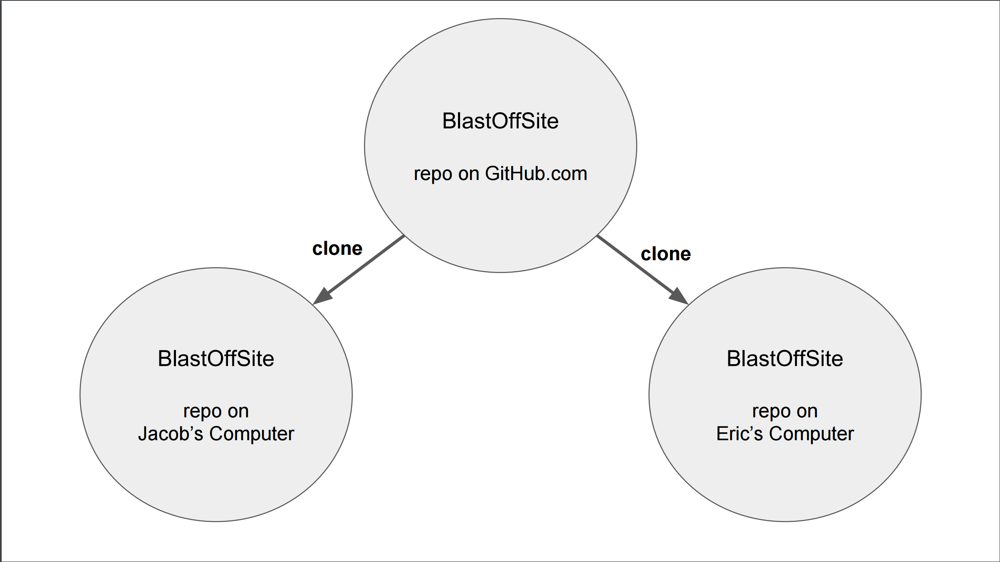
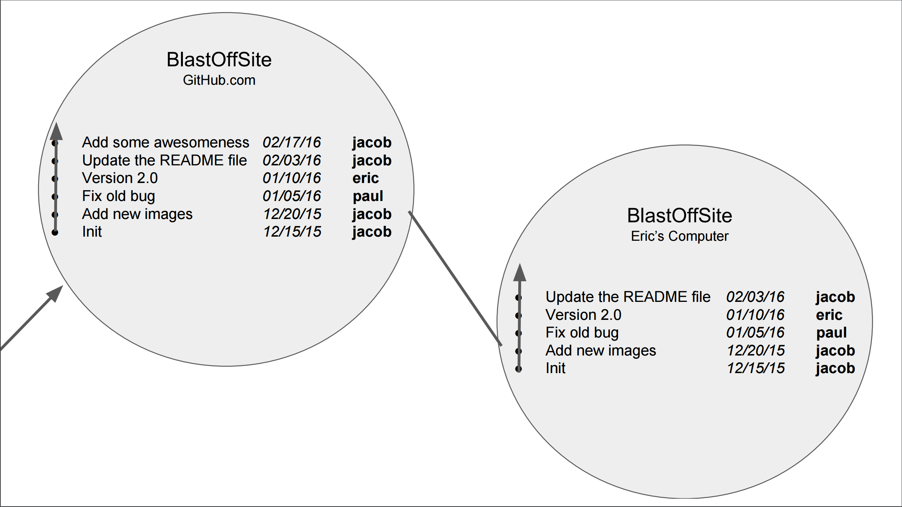

#  Objects (3:00)

### Objectives

*After this lesson, students will be able to:*

- Understand scope and use it to predict the values of variables
- Use JavaScript Objects and other data types to model complex data
- Store functions in variables, arrays and objects
- Create and understand Higher-order functions
- Accept User input in node application
- Fork, Clone, and Pull Request Git Repositories

### Agenda

| Timing | Topic |
| --- | --- |
| 10 min | Review: functions |
| 15 min | Scope |
| 20 min | JavaScript Objects |
| 20 min | Exercise: Modeling data |
| 15 min | Functions as Data Types |
| 20 min | Exercise: Math library |
| 20 min | Higher order functions |
| 20 min | Exercise: Array forEach |
| 15 min | Console Input |
| 20 min | Git Open Source Workflow |
| 5 min | Final Questions & Exit Tickets |


### Preparation
*Before this lesson, students should be able to:*

- Write functions with parameters and return values
- Use loops to organize repetitive code

---

## Review: functions (10 min)


### Function Declaration

Before we call, or "use", a function, we must define it.

```javascript
function speak() {
  console.log('Hello, world!');
}
```

### Calling Functions

Calling, or invoking, a function executes the code defined inside this function.

But defining and calling a function is different. A function will not be called when it's defined.

You call a function by using parenthesis after the function's name `()`:

```javascript
function speak() {
  console.log("hello there!")
}

speak;
// [Function: speak]

speak();
//=> hello there!
```

### Function Parameters

```javascript
function sayThanks(name) {
  console.log('Hello ' + name);
}

sayThanks('Mark');
=> 'Hello Mark'

sayThanks('Obama');
=> 'Hello Obama'
```

### Arguments

```javascript
// Parameter
function doSomething (parameter) {
  // does something
}

// Argument
doSomething(argument)
```

### Return values

```javascript
function sum(x, y) {
  return x + y;
}

var z = sum(3, 4);
// => 7
```

---

## Scope (15 min)

Scope is the set of variables you have access to. As we learned in the beginning of this class, JavaScript reads from top to bottom. Sometimes, however, we declare variables inside functions (just like arguments), which aren't accessible in other parts of our code. This is the concept of scope.


### The Global Scope


Before you write a line of JavaScript, you're in what we call the `Global Scope`. When a variable is declared outside a function, it is public—referred to as GLOBAL—and has a global scope. Any script or function on the page can then reference this variable.

For example, when you declare a variable right away, it's defined globally:

```javascript
var name = 'Gerry';
```

Global scope can be confusing when you run into namespace clashes. You don't want to use global scoping for all your variables--because using it correctly is highly complex--but every Javascript program uses the global scope in one way or another, so it’s important to be familiar with it.

### Local Scope

Conversely, if a variable is declared inside a function, it is referred to as LOCAL, and has a local scope.

A variable with local scope cannot be referenced outside of that function.

```javascript
var myGlobalVariable = 'hello';

function myFunction() {
  var myLocalVariable = 'world';
}
```

### Local and Global Scope

Take a look at the code below:

```javascript
var a = "this is the global scope";
function myFunction() {
  var b = "this variable is defined in the local scope";
}
myFunction();
console.log(b);
```

In this case, the console log will send a reference error because the variable `b` is not accessible outside the scope of the function in which it is defined.

In the logic defined above, the fact that a variable cannot be accessed by the parent scope works only in one way.

A function can access variables of the parent scope. In other words, a function defined in the global scope can access all variables defined in the global scope.

```javascript
// Global Scope
var a = "Hello";

// This function is defined in the global scope
function sayHello(name) {
    return a + " " + name;
}

sayHello("JavaScript");
=> "Hello JavaScript";
```


You can "look out" from the bubbles, but not look into them.

### Nested Function Scope

When a function is defined inside another function, it is possible to access variables defined in the parent from the child:

```javascript
var a = 1;

function getScore () {
  var b = 2,

  function add(c) {
    return a + b + c;
  }

  return add(3);
}

getScore();
// => 6
```

---

## JavaScript Objects

JavaScript Objects are basically a collection of properties, keys and values.

```javascript
var myObject = {};
```

### Properties, keys and values

**keys** must be string. Like indices in Arrays; how we locate values.
**values** any data type. Accessed by using the "key".

```javascript
var instructor = {
  'firstName': 'Jacob',
  'lastName': 'Friedmann',
  'age': 25,
  'your favorite color?': 'blue'
};
```

### Bracket Notation

Access values in an object by using bracket notation.

```javascript
var instructor = {
  'firstName': 'Jacob',
  'lastName': 'Friedmann',
  'age': 25,
  'your favorite color?': 'blue'
};

instructor['firstName'];
// 'Jacob'
```

### Setting value in an Object

If you use bracket notation on the left hand side of an assignment operator, you can set the value of a property.

```javascript
var instructor = {
  'firstName': 'Jacob',
  'lastName': 'Friedmann',
  'age': 25,
  'your favorite color?': 'blue'
};

instructor['occupation'] = 'Software Engineer';
```

### Keys without quotes

If the key doesn't have a spaces or other special characters, we don't need the quotes.

```javascript
var instructor = {
  firstName: 'Jacob',
  lastName: 'Friedmann',
  age: 25,
  'your favorite color?': 'blue'
};
```

### BEST PRACTICE

Use keys without spaces or special characters.

### Dot notation

If a key doesn't have spaces or special characters, we can also use dot notation to get and set values.

```javascript
var instructor = {
  firstName: 'Jacob',
  lastName: 'Friedmann',
  age: 25,
  'your favorite color?': 'blue'
};

instructor.firstName;
// 'Jacob'
instructor.occupation = 'Software Engineer';
```

---

## Exercise: Modeling data (20 min)

---

## Functions as Data Type (15 min)

### Functions are First-Class

Functions are "first class" in JavaScript, which means they can be used anywhere other data types are used:

- Stored in variables
- Stored in other data structures (like arrays and objects)
- Used as arguments
- Used as return values

### Function Expression

```javascript
var speakFunction = function speak() {
  console.log('hello world');
};

speakFunction();
```

### Anonymous Functions

When a function is used in a function expression, you don't need to include a name. We call a function without a name an Anonymous Function.

```javascript
var speakFunction = function () {
  console.log('hello world');
};

speakFunction();
```

This doesn't work for function declaration:

```javascript
function () {
  console.log('hello world');
}
// Syntax Error
```

### Functions in Objects

Functions can also be stored in Objects

```javascript
var spaceUtils = {
  galaxy: 'Milky Way',
  logPlanets: function () {
    var planets = ['Mercury', 'Venus', 'Mars'];

    for (var i = 0; i < planets.length; i++) {
      console.log(planets[i]);
    }
  }
}
```

---

## Exercise: First-Class Functions (20 min)

---

## Higher order functions (20 min)

Functions can also be parameters to other functions. A function that has a function parameter is called a "higer-order" function.

### What can `a` be?

```javascript
function helloWorld(a) {
  // do something
}
```

### Any data type including a function

```javascript
function speak(words) {
  console.log(words);
}

function helloWorld(a) {
  a('hello world!');
}

helloWorld(speak);
```

### Build forEach loop

We could write a function that loops through an array and calls another function for each element in the array.

```javascript
function myForEach(arr, func) {
  for (var i = 0; i < arr.length; i++) {
    func(arr[i]);
  }
}

function speak(word) {
  console.log(word);
}

myForEach(['hello', 'world'], speak);
```

### Array forEach

```javascript
var myArray = ['hello', 'world'];

function speak(word) {
  console.log(word);
}

myArray.forEach(speak);
```

### Array forEach Anonymous function

```javascript
var myArray = ['hello', 'world'];

myArray.forEach(function (word) {
  console.log(word);
});
```

---

## Exercise: Array forEach

---

## Getting user input in node (15 min)

### The prompt library

```javascript
var prompt = require('prompt');
```

### Start the "prompt"

```javascript
//
// Start the prompt
//
prompt.start();
```

### Collect user input

```javascript
//
// Get two properties from the user: username and email
//
prompt.get(['username', 'email'], function (err, result) {
  //
  // Log the results.
  //
  console.log('Command-line input received:');
  console.log('  username: ' + result.username);
  console.log('  email: ' + result.email);
});
```

---

## GitHub Open Source Workflow (20 min)

### Review: Simple Workflow

--


--


--



--


--


--


--


--



--


### Open Source


--


--


--


--


--


--


--


--


--


--

### Vocab

**fork** a fork is a new repository *on GitHub* with the same code and history as the repository it is "forked" from (the upstream repository). Forking a repository allows you to freely experiment with changes without affecting the original project.

**upstream repo** a repository from which another repository has been forked.

--

### Vocab

**(core) contributors** devolopers who have direct push/pull access to a repository/open source project.

**pull request** a request that an upstream repository pull changes from a fork. A pull request can be accepted into the upstream project or denied.

Note:

Why might we fork?

--

### Why Fork?

1. Don't have permission to push to original project.
2. Major diversion in project goal/strategy/functionality.
3. Need to make project compatible with your specific environment.

---

## Assignment 3

---


## Conclusion (5 min)

Make sure the lesson objectives have been met.

* Explain how you define and call functions using arguments.
