# 
## Events and Templating

- Implement advanced jQuery events.
- Use event delegation to manage dynamic content.
- Add a templating language to our projects for better and more abstracted content manipulation.

---

## Agenda

| Timing | Description |
| --- | --- |
| 20 min | Review |
| 10 min | jQuery functions |
| 15 min | Exercise: Manipulating the DOM |
| 20 min | Intro to Events |
| 30 min | Exercise: Todo List |

--

## Agenda

| Timing | Description |
| --- | --- |
| 15 min | Events in Depth |
| 15 min | Separation of Concerns, MVC |
| 20 min | Intro to Templating |
| 30 min | Exercise: Todo List MVC |
| 5 min | Final Questions & Exit Tickets |

---

## Finish Mid-Course Survey

---

## Review: Quiz

---

## jQuery functions

Note:

Now that we know how to find the different elements within the DOM, we need to know how to modify them.

--

### jQuery functions

```js
// Manipulate the elements CSS
$('#myId').css('color', 'blue');

// Change the HTML inside the elements
$('div').html('Hello World!');
```

--

### So Many jQuery Functions

- **[css()](http://api.jquery.com/css)**
- **[html()](http://api.jquery.com/html)**
- **[find()](http://api.jquery.com/find)**
- **[hide()](http://api.jquery.com/hide)**
- **[show()](http://api.jquery.com/show)**
- **[append()](http://api.jquery.com/append)**
- **[prepend()](http://api.jquery.com/prepend)**
- **[on()](http://api.jquery.com/on)**
- **[off()](http://api.jquery.com/off)**
- **[attr()](http://api.jquery.com/attr)**
- **[val()](http://api.jquery.com/val)**
- **[text()](http://api.jquery.com/text)**
- **[each()](http://api.jquery.com/each)**

---

## Exercise: Manipulating the DOM

- Change list items to blue
- Bold the first list item
- Make the title say TODO
- Add a text input and button after the title

---

## Intro to Events

Note:

Events, and responding to events, play an important role in JavaScript applications - especially those front-end applications. So far, the things we've done with JavaScript in the front end could be easily done by CSS and HTML alone. When JS becomes useful and interesting is when it used for responding to events.

--

### JS Front-End Applications

1. Find elements on the page
2. Listen for events on those elements (clicks, key press, etc)
3. Respond in some way

--

### Event Listener

A function used to respond to events:

```js
$('button').on('click', turnListItemsBlue);

function turnListItemsBlue() {
  $('li').css('color', 'blue');
}
```

--

### What other events?

--

### Browser Events

*Mouse Events*
- click
- dblclick
- mouseenter
- mouseleave

--

### Browser Events

*Keyboard Events*
- keypress
- keydown
- keyup

--

### Browser Events

*Form Events*
- submit
- change
- focus
- blur

--

### Browser Events

*Document/Window Events*
- load
- resize
- scroll
- unload

--

### Shorthand Events

Some common events let us bypass the `.on` call:

```js
$('button').on('click', doSomething);
// ===
$('button').click(doSomething);

$(document).ready(setup);
```

--

### `$(document).ready`

BEST PRACTICE: Before we start manipulating the DOM, wait for the `documents` ready event.

--

### `this` in jQuery

```js
$('li').on('click', doSomething);

function doSomething() {
  console.log(this);
  // the li that was clicked
}
```

Note:

`this` in JavaScript is complex and we will spend nearly a whole class on it later in the course. However, in jQuery event handler functions it has a specific meaning: the DOM element on which the event occurred.

--

### Using `this` in jQuery

```js
$('li').on('click', doSomething);

function doSomething() {
  // All `li`s on the page
  $('li').css('color', 'red');

  // Only the `li` that was clicked
  $(this).css('color', 'red');
}
```

---

## Exercise: TODO List

Note:

- Refactor the original code into a "setup" function
- When list items are clicked, add a strikethrough
- Find the button element
- When it is clicked, add an item to the list with the value of the input
- BONUS: Make the todo add when enter is pressed too

---

## Events in Depth

--

### Events Bubble

--

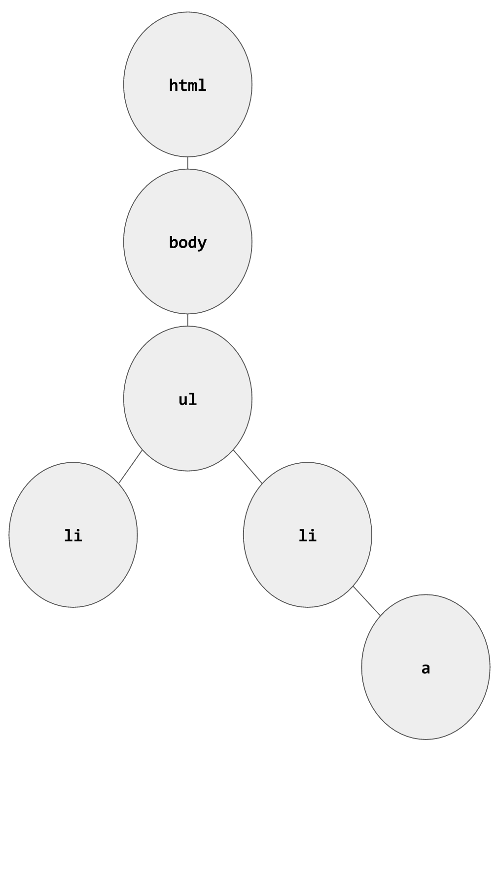

--

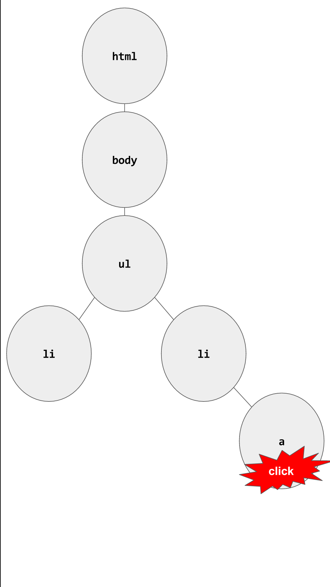

--

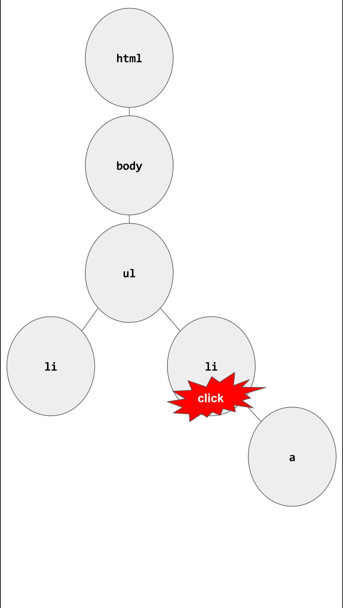

--

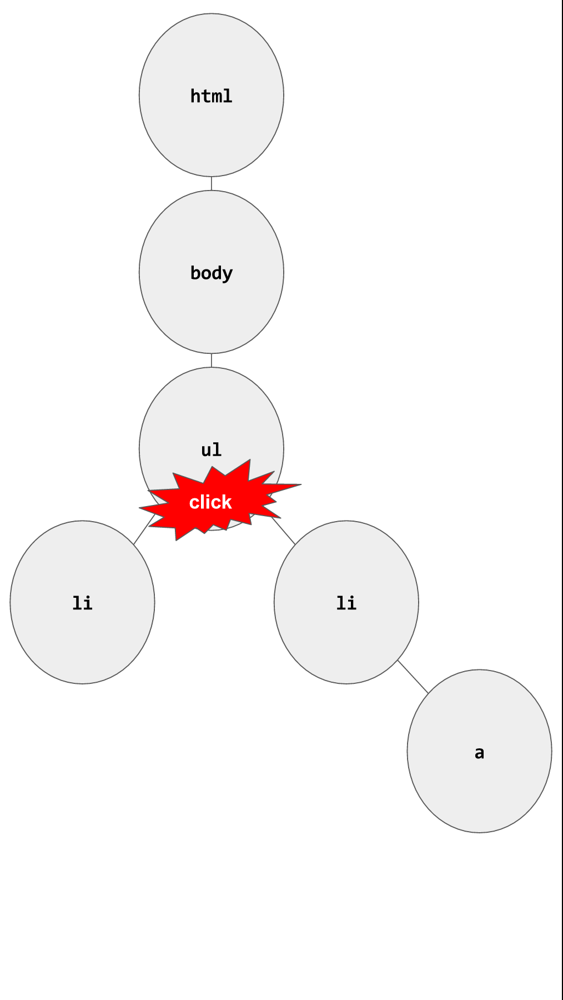

--

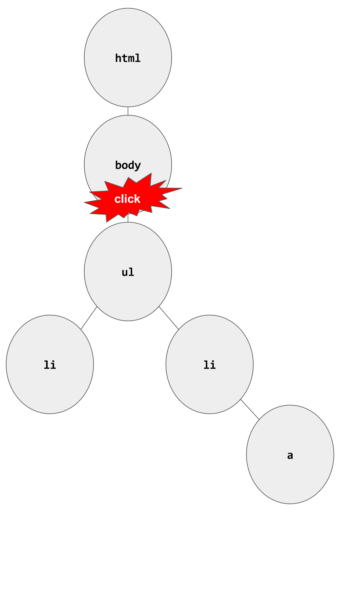

--

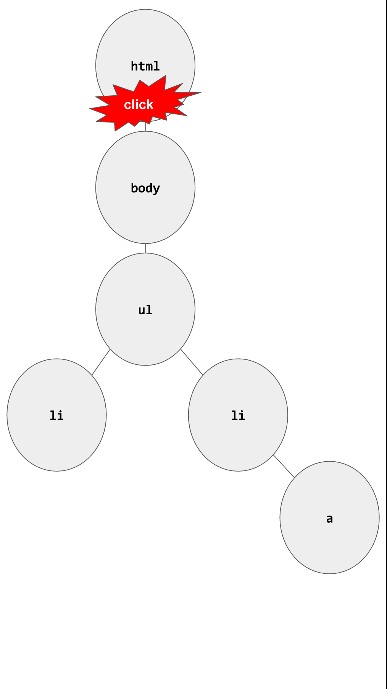

--

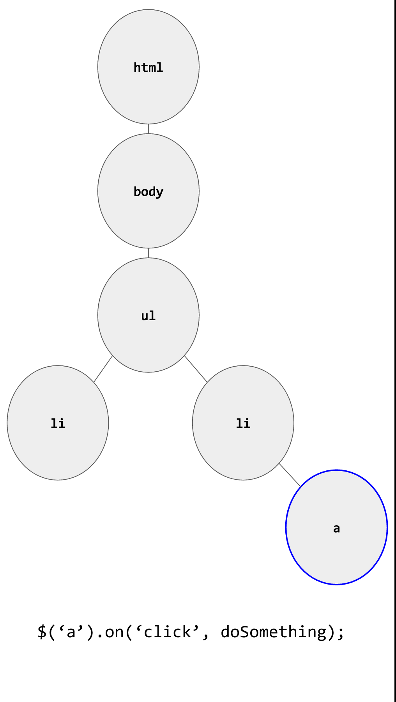

--

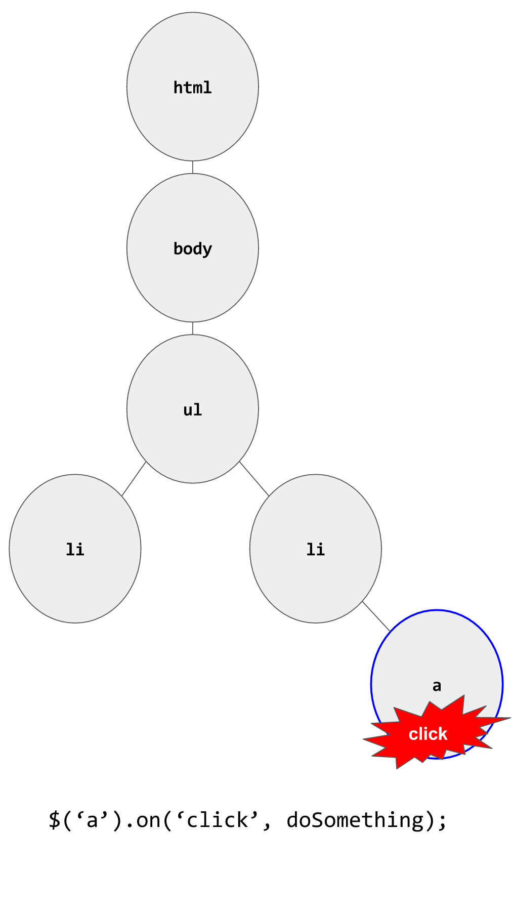

--

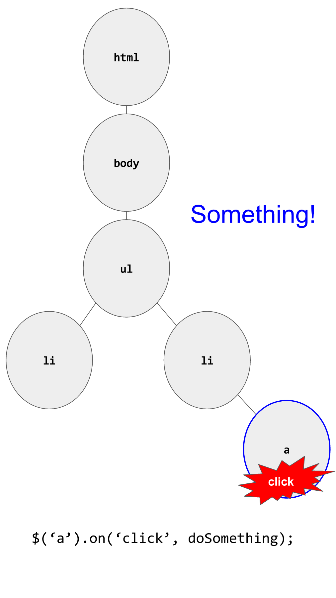

--

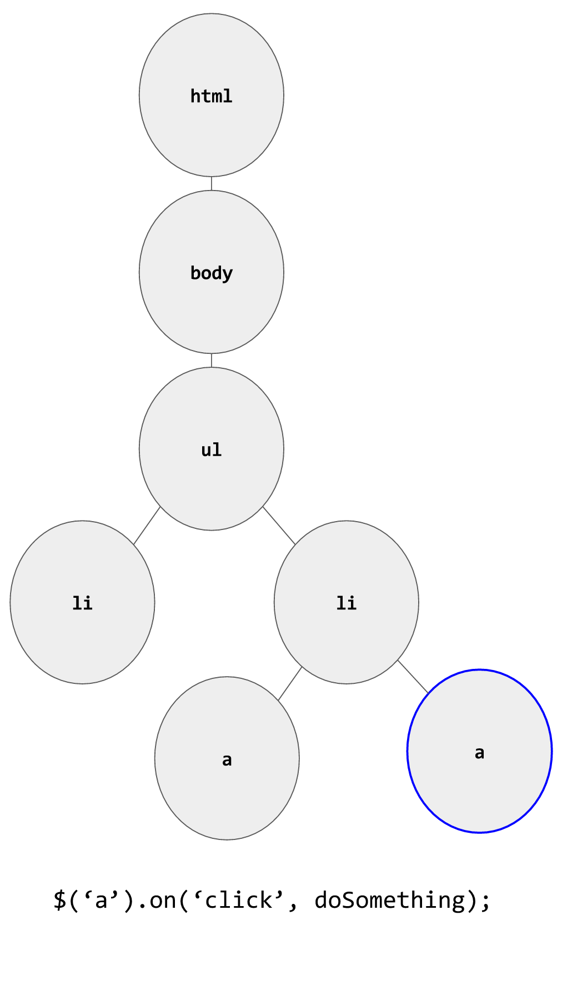

--

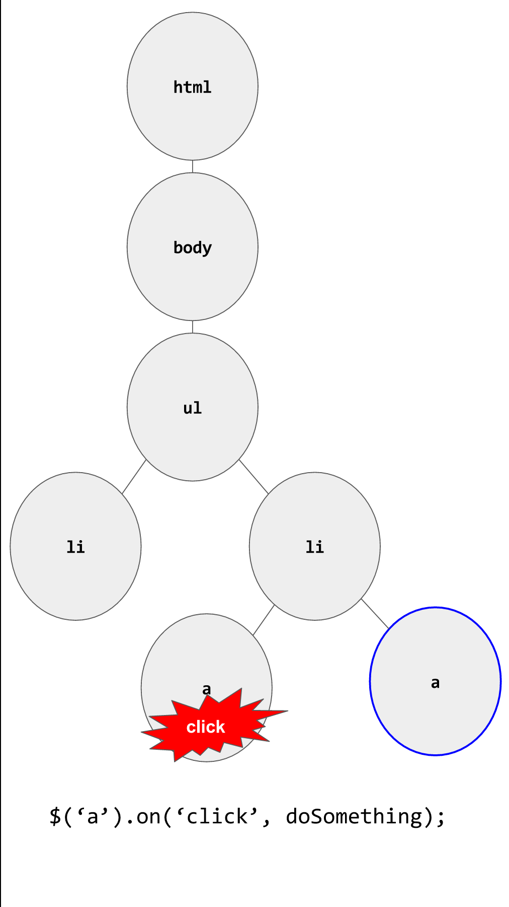

--

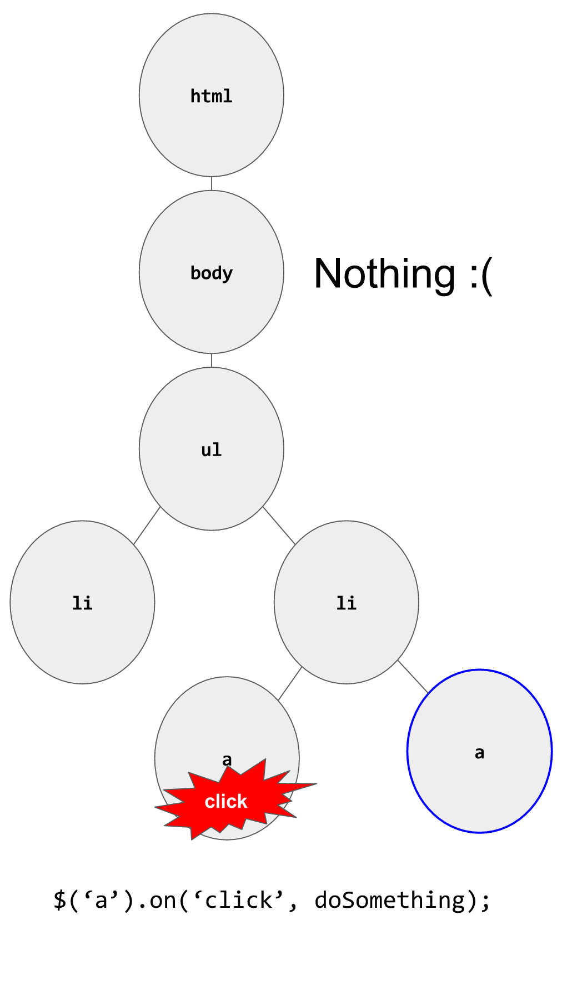

--

### Event Delegation

--

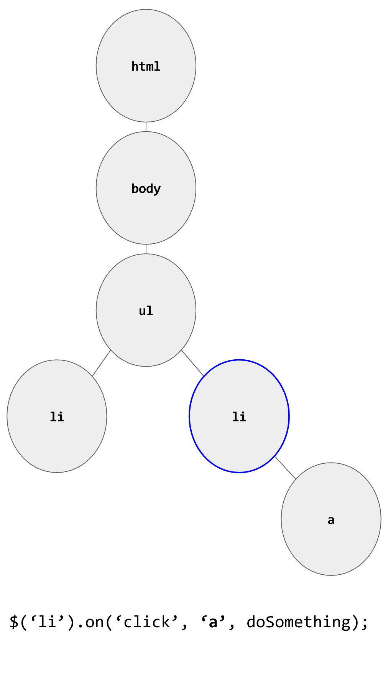

--

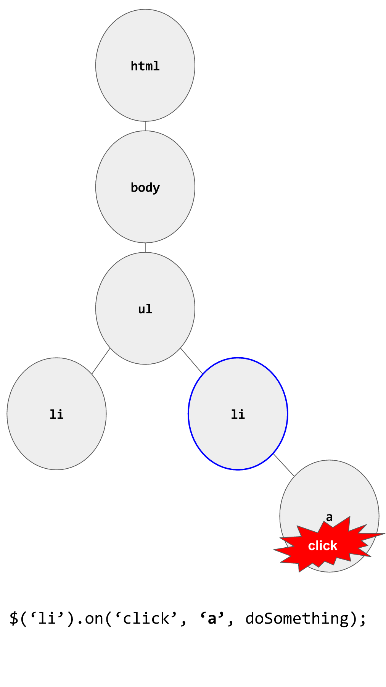

--


--

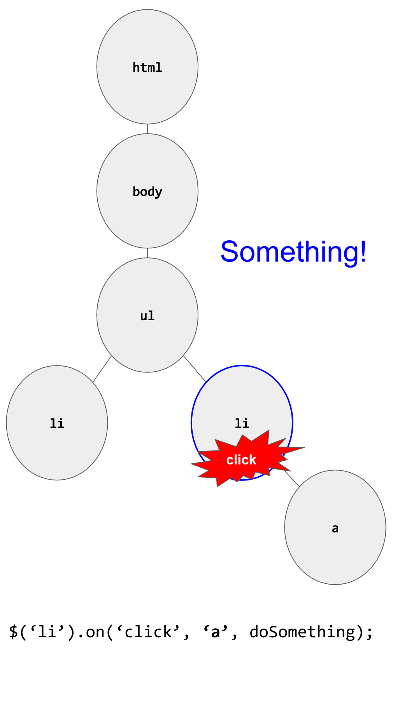

--

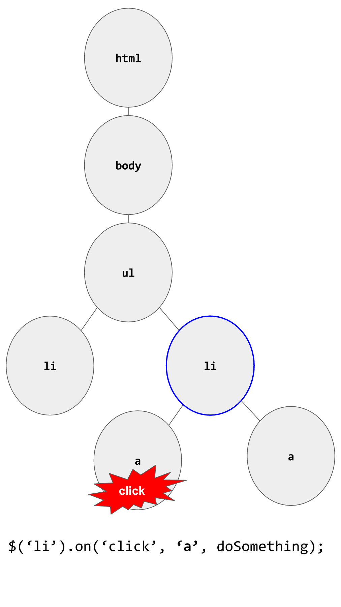

--


--

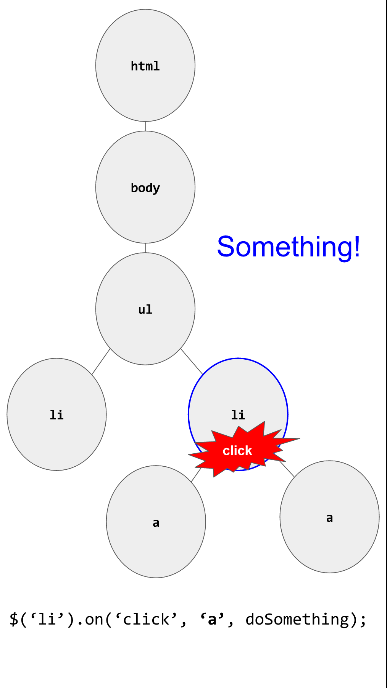

--

### Delegated jQuery Event Listener

```js
// Direct listener
$('#myList li').on('click', toggleItem);

// Delegated listener
$('#myList').on('click', 'li', toggleItem);
```

Note:

We can attach a listener to a parent element when children will be added dynamically. We can pass a selector that tells jQuery what children of the parent we want to listen to.

--

### Use jQuery to Create HTML Elements

```js
// Selects li elements
$('li');

// Creates an li element
$('<li>');
```

--

### Duel Nature of jQuery Functions

```js
// get the input value
var inputValue = $('input').val();

// set the input value
$('input').val('hello world');
```

Note:

Many jQuery functions can be used to get or set values depending on how many parameters are passed in.

---

## Separation of Concerns

--

### Separation of Concerns

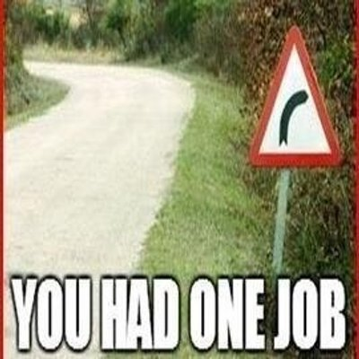

Note:

Separation of Concerns is a design principle that says we can simplify our code by keeping code that has different jobs (or concerns) in different places.

--

### SoC

In front-end applications, the "concerns" we often separate are:

- Models (Application State)
- Views (Rendering)
- Controllers (Communicating between Model and View)

--

### Model-View-Controller (MVC)

Foundation of:
- Backbone
- Angular
- Ruby on Rails
- Many others...

Note:

The MVC application architecture is very common in not only front-end, but also back-end applications. It is the foundation of Backbone, Angular, as well as Ruby on Rails and many other frameworks.

--

### Model

A representation of the application state represented in JavaScript data structures.

--

### Model

How can we create a Model for our "TODO" application?

--

### View

Templates and functions to render data into the templates.

---

## Intro to Templating

Note:

Templates are HTML snippets that have places to enter dynamic data.

--

### Templating Libraries

There are many templating libraries, all of which have similar capabilities.

- *[Handlebars](http://handlebarsjs.com/)*
- [Mustache](http://mustache.github.io/)
- [Underscore templates](http://underscorejs.org/)

--

### Add Handlebars To Project

To add handlebars, we need to add the script tag:

```html
<script src="https://cdnjs.cloudflare.com/ajax/libs/handlebars.js/4.0.5/handlebars.min.js"></script>
```

--

### Using Handlebars

Handlebars has a 4 step process to implementing templates in our applications:

  1. Create the template(s)
  2. Reference and compile template
  3. Pass the object to Handlebars for rendering
  4. Add the new rendered element to DOM

--

### Create the template

1. We create our element surrounded in script tags with a reference id and a type of handlebars template. We surround the content that's to be replaced by double curly brackets.

```html
  <script id="hello-world-template" type="text/x-handlebars-template">
    <h1>{{helloTitle}}</h1>
    <p>{{helloContent}}</p>
  </script>
```

--

### Reference and compile template

2. We can then use jQuery to reference the newly created template and pass that reference to Handlebars.

```js
  var source = $('#hello-world-template').html();
  var template = Handlebars.compile(source);
```

--

### Pass the object to Handlebars for rendering

3. We can then pass our data object to the newly created template.

```js
  var source = $('#hello-world-template').html();
  var template = Handlebars.compile(source);

  var helloStatement = {
      helloTitle: "Hello world",
      helloContent: "GA JS class is just awesome"
  };

  var renderedTemplate = template(helloStatement);
```

--

### Add the new rendered element to DOM

4. And add it to the DOM via jQuery.

```js
  var source = $('#hello-world-template').html();
  var template = Handlebars.compile(source);

  var helloStatement = {
      helloTitle: "Hello world",
      helloContent: "GA JS class is just awesome"
  };

  var renderedTemplate = template(helloStatement);
  $('body').append(renderedTemplate);
```

--

### View

How can we use Templating to create a View for our "TODO" application?

---

## Controller

Liaison between Model and View. Controller is responsible for event listeners and communicating those events to the Model.

--

### Controller

How can we make a Controller for our "TODO" application?

--

### jQuery `.parent()`

Find the parent element in the DOM tree.

--

### jQuery `.index()`

Find the index of a "sibling" element in the DOM

Note:

- Add "complete" link
- Now that we have the basic functionality of our TODO app, add the ability to delete a todo

---

## Final Project

- [Assignment](https://github.com/ga-students/JS-DC-2/final-project)
- [Ideas](https://gallery.generalassemb.ly/WDI?metro=)

--

### Final Project Schedule

- Idea Submission: July 18
- UI Draft: August 2
- In Class Lab Time: August 16
- Presentations/Due: August 18


---

## [Exit Ticket! (Class 9)](http://goo.gl/forms/KzVZ9fuo2YYw5WIB3)

---

# Goodnight :-)
