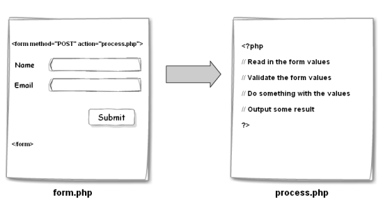

# 
## MVC & AJAX

- Use MVC to organize front-end applications
- Use Handlebars templates to turn JS into HTML
- Identify all the HTTP Verbs & their uses.
- Implement a jQuery AJAX client for a simple REST service.

---

## Agenda

| Timing | Topic |
| --- | --- |
| 15 min | Review |
| 20 min | Intro to Templating |
| 30 min | Exercise: Todo List MVC |

---

## Agenda

| Timing | Topic |
| --- | --- |
| 30 min | HTTP |
| 30 min | Web Application Architecture |
| 30 min | AJAX |
| 40 min | Exercise: Dynamic TODOS  |
| 5 min | Final Questions & Exit Tickets |

---

## Intro to Templating

Templates are HTML snippets that have places to enter dynamic data.

--

### Templating Examples in the Real World

- [GitHub](https://github.com)
- [General Assembly](https://generalassemb.ly/education/data-analytics)
- [StackOverflow](http://stackoverflow.com/)

--

### Templating Libraries

There are many templating libraries, all of which have similar capabilities.

- [Handlebars](http://handlebarsjs.com/)
- [Mustache](http://mustache.github.io/)
- [Underscore templates](http://underscorejs.org/)

We'll be using Handlebars.

--

### Add Handlebars To Project

To add handlebars, we need to add the script tag:

```html
<script src="https://cdnjs.cloudflare.com/ajax/libs/handlebars.js/4.0.5/handlebars.min.js"></script>
```

--

### Using Handlebars

Handlebars has a 4 step process to implementing templates in our applications:

  1. Create the template(s)
  2. Reference and compile template
  3. Pass the object to Handlebars for rendering
  4. Add the new rendered element to DOM

--

### Create the template

1. We create our element surrounded in script tags with a reference id and a type of handlebars template. We surround the content that's to be replaced by double curly brackets.

```html
<script id="hello-world-template" type="text/x-handlebars-template">
  <h1>{{helloTitle}}</h1>
  <p>{{helloContent}}</p>
</script>
```

--

### Reference and compile template

2. We can then use jQuery to reference the newly created template and pass that reference to Handlebars.

```js
var source = $('#hello-world-template').html();
var template = Handlebars.compile(source);
```

--

### Pass the object to Handlebars for rendering

3. We can then pass our data object to the newly created template.

```js
var source = $('#hello-world-template').html();
var template = Handlebars.compile(source);

var helloStatement = {
  helloTitle: "Hello world",
  helloContent: "GA JS class is just awesome"
};

var renderedTemplate = template(helloStatement);
```

--

### Add the new rendered element to DOM

4. And add it to the DOM via jQuery.

```js
var source = $('#hello-world-template').html();
var template = Handlebars.compile(source);

var helloStatement = {
  helloTitle: "Hello world",
  helloContent: "GA JS class is just awesome"
};

var renderedTemplate = template(helloStatement);
$('body').append(renderedTemplate);
```

--

How can we use Templating to create a View for our "TODO" application?

---

## Controller

Liaison between Model and View. Controller is responsible for event listeners and communicating those events to the Model.

--

### Controller

- Listening to events and relaying info to the model
- Telling the view when the model has updated

--

How can we make a Controller for our "TODO" application?

Note:

- First, simply add todos
- Add "complete" link, modify model for complete state

--

### Conditionals in Templates

```html
<div class="entry">
  {{!-- only output author name if an author exists --}}
  {{#if author}}
    <h1>{{firstName}} {{lastName}}</h1>
  {{/if}}
</div>
```

--

### jQuery `.parent()`

Find the parent element in the DOM tree.

--

### jQuery `.index()`

Find the index of a "sibling" element in the DOM

Note:

- Now that we have the basic functionality of our TODO app, add the ability to delete a todo

---

## HTTP


Hypertext Transfer Protocol

Note:

HTTP (hypertext transfer protocol) is a medium of communication between applications. It's most common use is for communicating between "client" applications (front-end code that runs in the browser) and "server" applications (back-end code).

--

### HTTP

Communication between "clients" and "servers".

--

### HTTP Clients

- Browsers
- Mobile applications
- Command line applications

--

### HTTP Servers

- _File servers_: Apache, Nginx
- _Programs written in any language_: PHP, Ruby, JavaScript (Node), Java, Python, etc

Note:

HTTP can be thought of like USPS, it is a mechanism of sending and receiving information.

--

### HTTP: Requests and Responses

--

### HTTP Request

In our mail metaphor, this is like an invoice: a piece of mail asking for something.

HTTP Requests come from the browser (or other clients).

--

#### HTTP Request: URL


- *protocol* - http, https, file
- *host* - an IP address or domain name where the server is located
- *port* - 80 by default, integer between 0 and 65535
- *path* - where on the server to look
- *query parameters* - key, value pairs

Note:

When making a request (like when sending an invoice), we need to specify where the request gets sent. The way we do this is by giving the request a Universal Resource Locater (URL address).

--

#### HTTP Request: Method (Verb)

HTTP Requests specify a "method" that defines what the request is intended to do. We sometimes call these methods HTTP "verbs":

- **GET**: ​*read*​ some data
- **POST**: ​*create*​ some data
- **PUT**: ​*update*​ some data
- **DELETE**: ​*delete*​ some data

--

When we enter and URL into the address bar of our browser, what kind of request do you think we are making?

--

#### HTTP Request: Headers

Request headers are metadata about your request. They can be used for authentication, cookies, security, and many other things:

Common headers:

- ​*"Cookie"*​ - a list of cookies that have been set on the browser
- ​*"Auth"*​ - encrypted auth information
- ​*"Content-type"*​ - tells server what kind of content is inside the request
- ​*"Origin"*​ - where the request came from

Note:

We can think of headers as stuff written on the outside of the envelope.

--

#### HTTP Request: Body

Optional extra text data we can send to the server. Especially useful for ​*PUT*​ and ​*POST*​ requests.

--

#### HTTP Request: Body

- JSON (JavaScript Object Notation)
- Form Data

--

### HTTP Response


Note:

When a server receives a request, it processes that request and then sends a response to the client.

If the request is an invoice, a response is the payment being sent back.

--

#### HTTP Response: Status Code

Was it successful?

Common Status Codes:

- ​*2XX*​ Success
   - ​*200*​ OK - the request was processed successfully
- ​*3XX*​ Redirects - the URL has changed
- ​*4XX*​ Problem with the request
   - ​*400*​ Bad Request (generic bad request code)
   - *403* Forbidden
   - ​*404*​ Not Found (The URL is wrong)
- ​*5XX*​ Problem with the server
   - ​*500*​ Generic server error
   - ​*503*​ Service Unavailable (usually happens when traffic is high)

--

#### HTTP Response: Headers

Just like the request, a response can also have headers describing metadata.

--

#### HTTP Response: Body

The body of a response can contain:

- HTML if we are requesting a webpage
- CSS if we're requesting linked stylesheets
- JS if we're requesting scripts
- JSON if we're requesting data

--

### Chrome Developer Tools

--

### The Network Tab

We can use the Chrome Network tab to look at HTTP Requests and Responses.

Note:

When we first load a page, we see the HTML is Requested. The browser then combs through the HTML and makes a request for each css file, image, javascript file in the markup.

--

### JSON (JavaScript Object Notation)

Data Format

Note:

JavaScript Object Notation is a data "format" that is often used to communicate over HTTP.

Servers written in all languages can communicate in JSON.

It is like English in our mail metaphor. A common "language" between services.

--

#### JSON Syntax

Looks just like JavaScript Objects, but with stricter syntax:

```json
{
    "key": "value",
    "anotherKey": [
        1,
        2,
        3
    ]
}
```

Note:

Luckily, we don't usually write our own JSON, we let libraries handle converting real Objects to JSON for us.

--

#### JSON Values

Values can be:

- Numbers
- Objects
- Arrays
- Strings
- Booleans
- null

--

#### Install JSON Formatter

--

#### JSON Demo

We can use the console we can experiment with the global JSON object that has methods for converting data to JSON.

---

## Web Application Architecture

--

### Traditional Web App


Note:

A traditional webpage loads all of the data it needs when the page first loads. In order to get new data, refresh the page.

--

#### Traditional App: Form POST



Note:

When submitting a form, the browser automatically creates a HTTP POST Request. The body of this Form POST

When this happens, the browser loads a new page (or refreshes) and we lose the JavaScript context.

--

#### Traditional App: Form POST

Browser reloads the page, or a different page. Bye bye JS context.

--

#### Form POST

```html
<form action="/process-form.php" method="post">
  <input name="username" type="text" />
  <input type="submit" value="Submit" />
</form>
```

--

### Modern, Single Page Application


Note:

In modern, Single Page Applications, when we need new data or to submit data to a server, instead of refreshing, we can use JavaScript to make HTTP Requests. The process and mechanism for doing this is call AJAX (Asynchronous JavaScript and XML).

---

## AJAX

_Asynchronous JavaScript and XML_: Make HTTP Requests using JavaScript, no page reload needed.

Note:

AJAX is the process of making HTTP requests with JavaScript without reloading or refreshing a webpage.

The name AJAX (Asynchronous JavaScript and XML) is an artifact of a bygone era when XML was the primary format for communication over HTTP. It has since been usurped by JSON. Though applications that use XML are still present, they are much less common.

--

### Ways of making AJAX Requests

- `XMLHttpRequest`
- jQuery's AJAX library
- `fetch`

--

### The XMLHttpRequest Object

Much like `document.getElementById` et. al. working with the XMLHttpRequest Object directly is verbose and a bit painful.

Note:

When using JavaScript in the browser, there is a global Object called `XMLHttpRequest` (also a misnomer) that allows us to make HTTP Requests.

--

### jQuery AJAX

Much like jQuery helps to make interacting with the DOM easier, jQuery also has functions for making AJAX requests.

--

#### `$.get`

```js
function processResponse(response) {
  console.log(response);
}
// All we need to create a get or post request is use the get or post method
$.get(
  'https://data.cityofnewyork.us/api/views/jb7j-dtam/rows.json?accessType=DOWNLOAD',
  processResponse
);
```

--

#### Exercise: AJAX TODOs

--

#### `$.ajax`

This is the "longform" ajax method that is more versatile than `$.get` or `$.post`.

--

#### jQuery Options

```js
$.ajax({
    type: 'GET',
    url: 'https://data.cityofnewyork.us/api/views/jb7j-dtam/rows.json?accessType=DOWNLOAD',
    success: processResponse
});
```

Note:

In addition to accepting ordered parameters with specific meaning, many jQuery functions will accept "options" Objects that allow for more configurable use:

--

#### Exercise: Refactor AJAX TODOS

---

## Final Project

- [Assignment](https://github.com/ga-students/JS-DC-2/final-project)
- [Ideas](https://gallery.generalassemb.ly/WDI?metro=)

--

### Final Project Schedule

- Idea Submission: July 24
- UI Draft: August 2
- In Class Lab Time: August 16
- Presentations/Due: August 18

---

## [Exit Ticket! (Class 10)](http://goo.gl/forms/KzVZ9fuo2YYw5WIB3)

---

# Goodnight :-)
