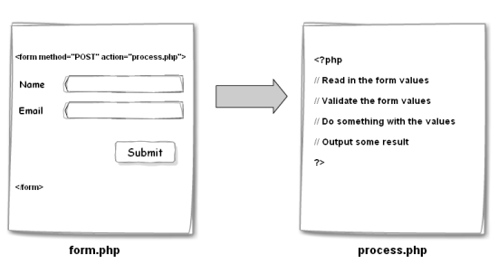

#  HTTP and AJAX (3:00)

##  Objectives
*After this lesson, students will be able to:*

- Identify all the parts HTTP Requests and responses.
- Implement a jQuery AJAX client for a simple data fetching.
- Understand high level web application architecture (Client vs. Server).

## Agenda

| Timing | Topic |
| --- | --- |
| 25 min | Review: HW |
| 20 min | HTTP |
| 20 min | Exercise: CURL |
| 30 min | Web Application Architecture |
| 20 min | AJAX |
| 10 min | JSON |
| 40 min | Exercise: AJAX TODOS |
| 5 min | Final Questions & Exit Tickets |

> Note: there's a lot of content to get through in this lesson--if you're short on time, you can assign the Open Weather Map lab as homework.

## Preparation
*Before this lesson, students should already be able to:*

- Implement advanced jQuery events.
- Use event delegation to manage dynamic content.
- Use implicit iteration to update elements of a jQuery selection and chaining to place methods on selectors.
- Add a templating language to our projects for better content manipulation.

> Note: Last class, we learned how to manipulate the DOM using jQuery and even learned some handlebars.js! Check with students to make sure that everyone is comfortable with the materials covered in the last class.

---

## HW Review

---

## HTTP


HTTP (hypertext transfer protocol) is a medium of communication between applications. It's most common use is for communicating between "client" applications (front-end code that runs in the browser) and "server" applications (back-end code).

Clients can be:
- Browsers
- Mobile applications
- Command line applications

Servers can be:
- File servers: Apache, Nginx
- Programs written in any language: PHP, Ruby, JavaScript (Node), Java, Python, etc

HTTP can be thought of like USPS, it is a mechanism of sending and receiving information.

### HTTP Request

In our mail metaphor, this is like an invoice: a piece of mail asking for something.

HTTP Requests come from the browser (or other clients).

#### HTTP Request: URL

When making a request (like when sending an invoice), we need to specify where the request gets sent. The way we do this is by giving the request a Universal Resource Locater (URL address).


- *protocol* - http, https, file
- *host* - an IP address or domain name where the server is located
- *port* - 80 by default, integer between 0 and 65535
- *path* - where on the server to look
- *query parameters* - key, value pairs

#### HTTP Request: Method (Verb)

HTTP Requests specify a "method" that defines what the request is intended to do. We sometimes call these methods HTTP "verbs":

- **GET**: ​*read*​ some data
- **POST**: ​*create*​ some data
- **PUT**: ​*update*​ some data
- **DELETE**: ​*delete*​ some data

When we enter and URL into the address bar of our browser, what kind of request do you think we are making?

#### HTTP Request: Headers

Request headers are metadata about your request. They can be used for authentication, cookies, security, and many other things:

Common headers:

- ​*"Cookie"*​ - a list of cookies that have been set on the browser
- ​*"Auth"*​ - encrypted auth information
- ​*"Content-type"*​ - tells server what kind of content is inside the request
- ​*"Origin"*​ - where the request came from

We can think of headers as stuff written on the outside of the envelope.

#### HTTP Request: Body

Optional extra text data we can send to the server. Especially useful for ​*PUT*​ and ​*POST*​ requests.

Body data is typically in the form of JSON (JavaScript Object Notation) or Form Data.

### HTTP Response

When a server receives a request, it processes that request and then sends a response to the client.

If the request is an invoice, a response is the payment being sent back.

#### HTTP Response: Status Code

Every HTTP Response has a status code that represents whether or not the request was successfully fulfilled.

Common Status Codes:

- ​*2XX*​ Success
   - ​*200*​ OK - the request was processed successfully
- ​*3XX*​ Redirects - the URL has changed
- ​*4XX*​ Problem with the request
   - ​*400*​ Bad Request (generic bad request code)
   - *403* Forbidden
   - ​*404*​ Not Found (The URL is wrong)
- ​*5XX*​ Problem with the server
   - ​*500*​ Generic server error
   - ​*503*​ Service Unavailable (usually happens when traffic is high)

#### HTTP Response: Headers

Just like the request, a response can also have headers describing metadata.

#### HTTP Response: Body

The body of a response can contain:

- HTML if we are requesting a webpage
- CSS if we're requesting linked stylesheets
- JS if we're requesting scripts
- JSON if we're requesting data

### Exercise: `curl`

Note:
- curl http://example.com
- explain all of the parts
- do a POST request
- fix the 411 response by setting a Content-length header

### The Network Tab

We can use the Chrome Network tab to look at HTTP Requests and Responses.

When we first load a page, we see the HTML is Requested. The browser then combs through the HTML and makes a request for each css file, image, javascript file in the markup.

---

## Web Application Architecture

### Traditional Web App

A traditional webpage loads all of the data it needs when the page first loads. In order to get new data, refresh the page.


#### Traditional App: Form POST

When submitting a form, the browser automatically creates a HTTP POST Request. The body of this Form POST



When this happens, the browser loads a new page (or refreshes) and we lose the JavaScript context.

#### Form POST

```html
<form action="/process-form.php" method="post">
  <input name="username" type="text" />
  <input type="submit" value="Submit" />
</form>
```

### Modern, Single Page Application

In modern, Single Page Applications, when we need new data or to submit data to a server, instead of refreshing, we can use JavaScript to make HTTP Requests. The process and mechanism for doing this is call AJAX (Asynchronous JavaScript and XML).


---

## AJAX

AJAX is the process of making HTTP requests with JavaScript without reloading or refreshing a webpage.

The name AJAX (Asynchronous JavaScript and XML) is an artifact of a bygone era when XML was the primary format for communication over HTTP. It has since been usurped by JSON. Though applications that use XML are still present, they are much less common.

Ways of making AJAX Requests:

- `XMLHttpRequest`
- jQuery's AJAX library
- `fetch`

### The XMLHttpRequest Object

When using JavaScript in the browser, there is a global Object called `XMLHttpRequest` (also a misnomer) that allows us to make HTTP Requests.

Much like `document.getElementById` et. al. working with the XMLHttpRequest Object directly is verbose and a bit painful.

### jQuery AJAX

Much like jQuery helps to make interacting with the DOM easier, jQuery also has functions for making AJAX requests.

#### `$.get`

```js
function processResponse(response) {
  console.log(response);
}
// All we need to create a get or post request is use the get or post method
$.get(
  'https://data.cityofnewyork.us/api/views/jb7j-dtam/rows.json?accessType=DOWNLOAD',
  processResponse
);
```

### JSON

JavaScript Object Notation is a data "format" that is often used to communicate over HTTP.

Servers written in all languages can communicate in JSON.

It is like English in our mail metaphor. A common "language" between services.

#### JSON Syntax

Looks just like JavaScript Objects, but with stricter syntax:

```json
{
    "key": "value",
    "anotherKey": [
        1,
        2,
        3
    ]
}
```

Luckily, we don't usually write our own JSON, we let libraries handle converting real Objects to JSON for us.

#### JSON Values

Values can be:

- Numbers
- Objects
- Arrays
- Strings
- Booleans
- null

#### JSON Demo

We can use the console we can experiment with the global JSON object that has methods for converting data to JSON.

#### Exercise: AJAX TODOs

#### `$.ajax`

This is the "longform" ajax method that is more versatile than `$.get` or `$.post`.

#### jQuery Options

In addition to accepting ordered parameters with specific meaning, many jQuery functions will accept "options" Objects that allow for more configurable use:

```js
$.ajax({
    type: 'GET',
    url: 'https://data.cityofnewyork.us/api/views/jb7j-dtam/rows.json?accessType=DOWNLOAD',
    success: processResponse
});
```

---

#### Exercise: Refactor AJAX TODOS
