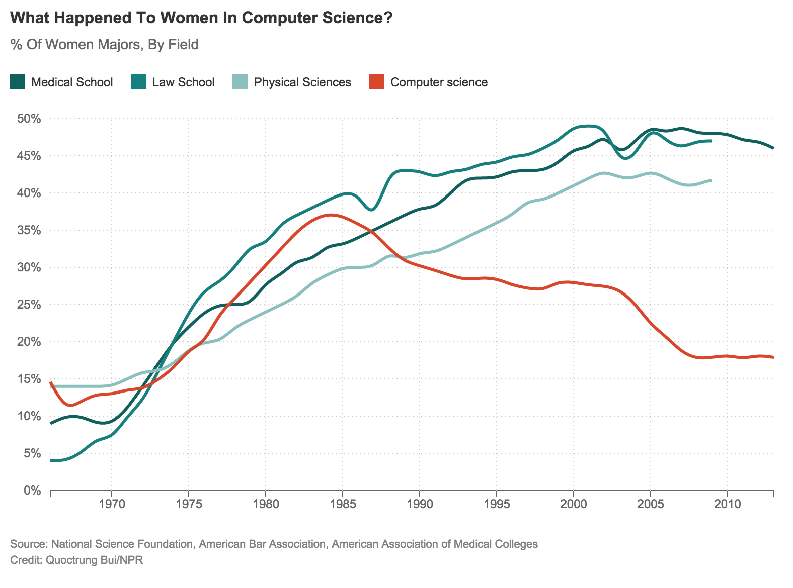

#  Debugging & AJAX  (3:00)

##  Objectives
*After this lesson, students will be able to:*

- Use Chrome's Dev Tools to solve common JS bugs and errors
- Use HTML forms to accept user input and make AJAX requests

## Agenda

| Timing | Topic |
| --- | --- |
| 20 min | Review |
| 20 min | Intro to Debugging |
| 20 min | Debugging Techniques |
| 35 min | Debugging Exercise |
| 30 min | Forms & Event Objects |
| 35 min | Forms Exercise |
| 5 min | Final Questions & Exit Tickets |

## Preparation
*Before this lesson, students should already be able to:*

- Make AJAX requests using jQuery
- Open Chrome's Dev Tools, use Network tab to inspect HTTP requests

---

## Review

---

## Intro to Debugging

Why isn't this working?

--

### Admiral Grace Hopper


Note:
- Worked on Harvard Mark I during WWII, working to decrypt enemy messages
- Created the first Computer Compiler Program, the foundation of modern languages
- Created, in large part, COBOL the most widely used programming language of all time, still around today

--

### Mark II (Colossus)


Note:

- She and her team were working on the Mark II in 1947 in Virginia when the discovered, quite literally, a bug in the system.

--

### The first "bug"


--

### Women in Computing

--

### Ada Lovelace


Note:
- Daughter of the poet Lord Byron
- Considered the first computer programmer
- Worked with Charles Babbage on his Analytical Engine
- Wrote a program (the first) to compute the Bernoulli numbers

--

### Adele Goldberg


Note:

- Created the language Smalltalk, the first language to use the concept "Object Oriented Programming"
- Worked at the famous Xerox PARC and initially refused to present to Steve Jobs because she knew it was a mistake

--

### [The Innovators, Walter Isaacson](https://www.amazon.com/Innovators-Hackers-Geniuses-Created-Revolution/dp/147670869X)

--



--

### [Learn More](http://www.npr.org/sections/money/2014/10/21/357629765/when-women-stopped-coding)

---

##Debugging

"The image is moving the wrong direction"

__vs__

"None of my code works"

--

##Debugging

This will tell you where to start your hunt

*   Image moving the wrong direction
    *   find the code that makes the image move

*   None of my code works
    *   "Runtime" error, check console

---

### Most Common Runtime Errors

#### Reference Error

This happens when we reference a variable that hasn't been declared.

```js
var b = c + 10;

// Reference Error: c is not defined
```

#### Syntax Error

Unbalanced parentheses, stray semi-colons, etc

```js
var person = {
  firstName: 'Jacob';
  lastName: 'Friedmann'
};

// Syntax Error: Unexpected Token ';'
```

#### Type Error

Trying to use one data type like another.

```js
var i = 0;

i();
// Type Error: 'i' is not a function
```

## Debugging: Level __1__

Check for errors (red text) in console

Ex: Unbalanced brackets or parentheses

--

##Debugging: Level __2__

So no red errors but not getting the right answer?

Try console.log

Ex:

```javascript
if (lightOn) {
    console.log("it's on! it's on!!");
}
```

--

##Debugging: Level __3__

*   Use the debugger in Chrome
*   Set a breakpoint
*   Run the code
*   Step through the code until you get to the error
*   Variable values display on the right
*   You can switch to the console to run code or check value of variable

--

##Debugging: Level __4__

Get help!

1.  Try Google
2.  Be ready to clearly articulate the problem (Write out what your problem is)
3.  If nothing, ask instructor

---

## Event Objects & Forms

### Event Objects

Event Listener functions receive a parameter that represents the event itself.

```js

$('button').on('click', doSomething);

function doSomething(event) {
  console.log(event.type);
  // 'click'

  console.log(event.target === this);
  // true
}
```

### What can the Event Object be used for?

- Finding what key was pressed
- Finding where exactly a click occurred (x, y coordinates)
- Prevent the browser's default response to that event

### Forms

When a form is submitted, the browser by default tries to make a HTTP request, which means our JS stops running.

```html
<form id="loginForm" method="post" action="/login">
  <input name="email" type="email" />
  <input name="password" type="password" />
  <input type="submit" value="Login" />
</form>
```

When the submit button is clicked, a "submit" event is generated which will make the browser create a POST request to `/login` by changing the pages address in the address bar.

We can prevent that default behavior if we need to:

### `event.preventDefault()`

```js
$('#loginForm').on('submit', processLoginForm);

function processLoginForm(event) {
  // Stop the browser from making the HTTP request
  event.preventDefault();
}
```

### Processing form using AJAX

We can now use AJAX to submit the form instead of letting the browser do it for us.

```js
$('#loginForm').on('submit', processLoginForm);

function processLoginForm(event) {
  // Stop the browser from making the HTTP request
  event.preventDefault();

  var data = {
    email: $('input[name="email"]').val(),
    password: $('input[name="password"]').val()
  };

  $.post('/login', data, processLoginResponse);
}
```

### Exercise: Forms
