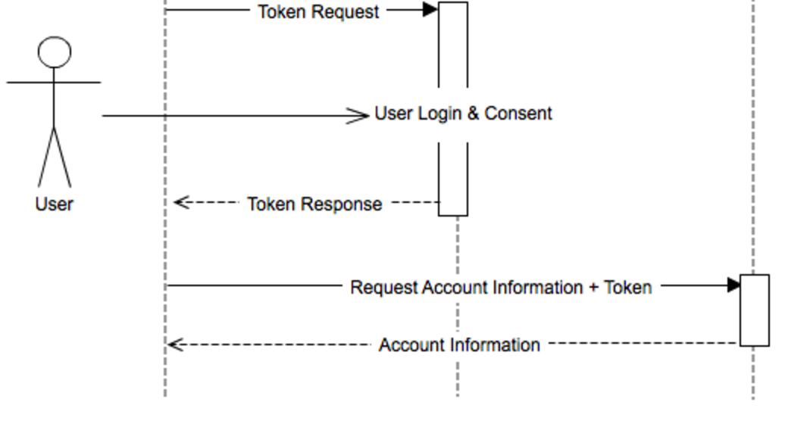

#  APIs (3:00)

##  Objectives
*After this lesson, students will be able to:*

- Describe what an API is and how to use it
- Read documentation to integrate an HTTP API
- Build an front-end application that uses OAuth for authentication

## Agenda

| Timing | Topic |
| --- | --- |
| 15 min | HW Review |
| 20 min | Intro to APIs |
| 30 min | Exercise: Weatherify |
| 20 min | Advanced APIs |
| 90 min | Exercise: LocalLandscapes |
| 5 min | Final Questions & Exit Tickets |

> Note: there's a lot of content to get through in this lesson--if you're short on time, you can assign the Open Weather Map lab as homework.

## Preparation
*Before this lesson, students should already be able to:*

- Make AJAX requests and consume returned data
- Use Chrome's Dev Tools to debug common issues, including those related to the network

---

## HW Review

---

## Intro to APIs

Application Programming Interface

How we interact with programs, without bothering us with the details of implementation. It's what we read in documentation.

### Types of APIs

There are different interfaces that we may interact with.

#### Language APIs

For example, the JavaScript API. A language API contains functions, parameters, return values and a description of what it does.

- [`Math.pow`](https://developer.mozilla.org/en-US/docs/Web/JavaScript/Reference/Global_Objects/Math/pow)
- [`document.getElementById`](https://developer.mozilla.org/en-US/docs/Web/API/Document/getElementById)

#### Library APIs

For example, the jQuery API.

- [`$.ajax`](http://api.jquery.com/jquery.ajax/)
- [`$.animate`](http://api.jquery.com/animate/)

#### HTTP APIs

How we interact with services, like Facebook, Twitter, Instagram, OpenWeatherMap, etc.

Instead of functions, HTTP Methods + URLs (endpoints)

Instead of function parameters, query parameters

Instead of return values, example JSON responses

```
endpoint
========

GET /api/user

parameters
----------

userId - the id for the user

response
--------

{
  "id": 123,
  "name": "Jacob"
}
```

- [NYT Books](https://developer.nytimes.com/books_api.json#/Documentation/GET/lists.%7Bformat%7D)
- [Instagram](https://www.instagram.com/developer/endpoints/comments/)

### REST

Representational State Transfer. A way of designing HTTP APIs. For this reason, we sometimes call HTTP APIs REST APIs.

```
GET /api/user/:userid

POST /api/user

PUT /api/user/:userid

DELETE /api/user/:userid
```

These endpoints, taken together would be called a "resource". In this case, the user resource.

### Authentication

There are two primary methods used for API Authentication.

- API Keys (simple)
- OAuth (complex)

#### API Key Auth

Generate a token on the website and include it in requests.

---

## Exercise: [Open Weather Map API](http://openweathermap.org/api)

---

## Advanced API Concepts

### Authentication

- API Keys (simple)
- OAuth (complex)

#### OAuth

An open authentication standard that allows you to authenticate your application on behalf of a user.



The OAuth flow is complicated and implemented differently by different services.

### Custom Client Libraries / SDKs

Thankfully, most services that employ OAuth type authentication will also provide a library that can be used to execute OAuth requests. Generally, these libraries will be offered in many different languages, JS being one of them.

---

## Exercise: [LocalLandscapes](starter-code/locallandscapes/readme.md)
