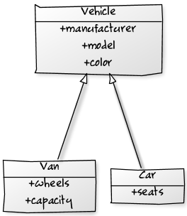

# Class 15 Bonus Material

## Object Oriented Programming: Inheritance

We've discussed that classes describe a type of Object, specifically what properties and methods instances will have. In OOP, classes can also inherit the properties and methods of other classes.

For example, if we have an Animal class, there might also be a Dog class that inherits from Animal. This means that a Dog has all the methods and properties of the Animal class, but might also have a few more (i.e. `bark()`).

A class that inherits from another class is called a "Child Class" or sometimes "Subclass". In this case, Animal is a "Parent class" or "Superclass" and Dog is a "Child" or "Sub" class.

If I have a Dog named "spots", spots is an instance of the Dog class, but "spots" is also an instance of the Animal class.



## Inheritance in JavaScript

In JavaScript, as with most languages that Object Oriented Programming, all classes inherit from a base class called Object. Sometimes we call this a "plain" object or a POJO (Plain Old JavaScript Object).

POJO
```js
{
  property: "value"
}
```

The Array class (and every other class) is a child class of Object, so when we create an array it is both an instance of Array class and an instance of the Object class.
