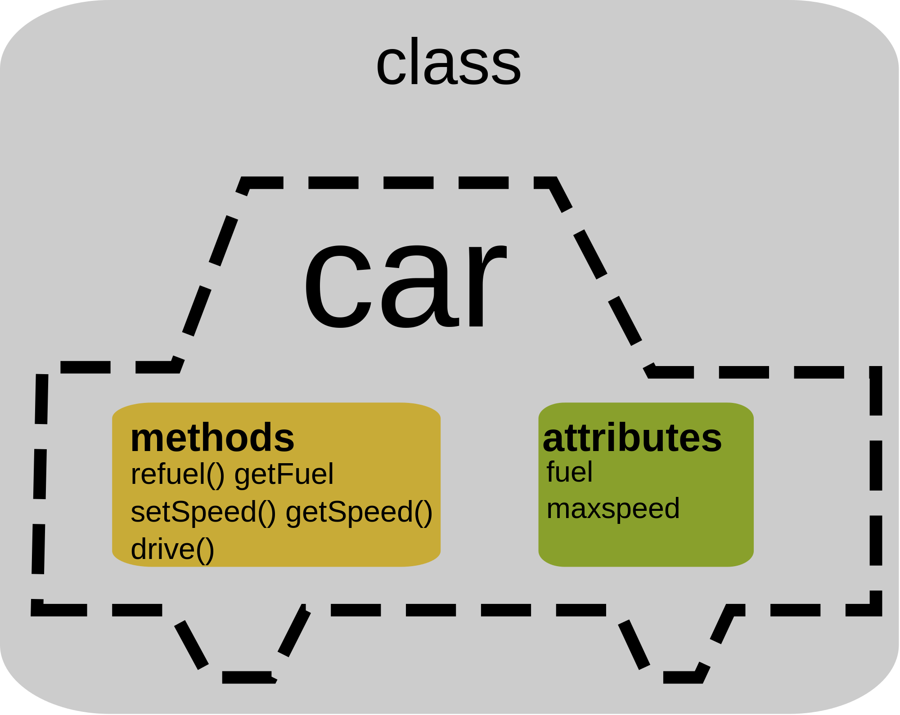
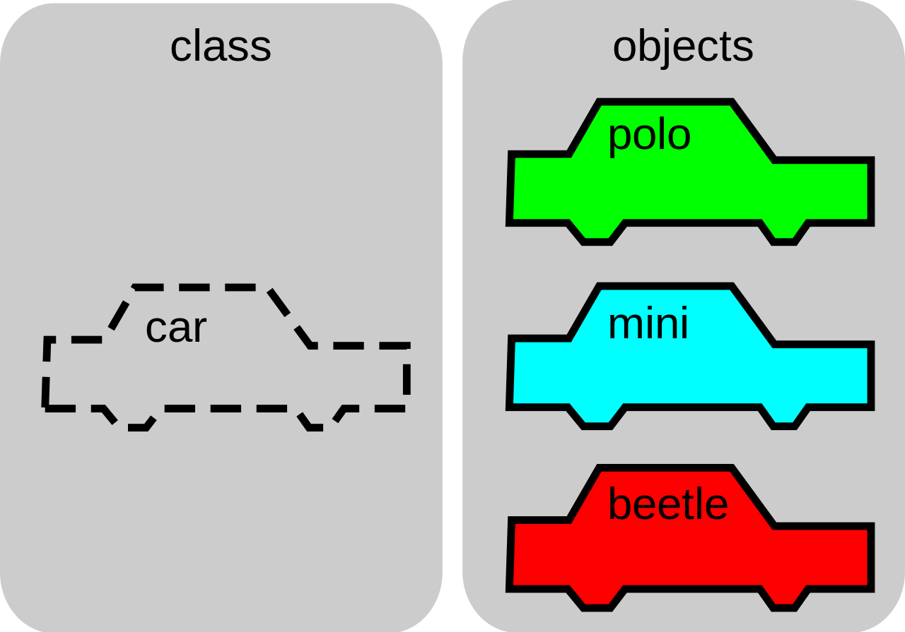

# 
## Firebase Intro to Object Oriented JavaScript

- Use Firebase database API to persist real-time data
- Explain the concepts of Object Oriented Programming

--

### Agenda

| Timing | Topic |
| --- | --- |
| 30 min | Lab Review |
| 110 min | Firebase Codealong |
| 30 min | Intro to Object Oriented Programming |
| 10 min | Final Questions & Exit Tickets |

---

## Lab Review

--

### Sequencing AJAX Requests

--

### Going from HTML to Model

---

## Code-along: JS Chat

- Register a new Firebase Application
- Set up the JavaScript client library
- Learn and use the Firebase APIs:
    - Auth
    - *Database CRUD*
- *Deploy our application*

---

## `firebase.database()`

The database API can be used to persist data and communicate data to other users.

--

#### Persist data

When I come back to the site, things I've added are still there.

--

#### Communicate data

When I update something, other users can see it.

--

#### Real-time data

Firebase gives us the added ability to see changes made by other users in real time.

--

#### CRUD

When working with databases, we typically perform 1 of 4 operations:

- *C* reate
- *R* ead
- *U* pdate
- *D* elete

Note:
What do these operations remind you of?

--

#### Getting a reference to the database

We can think of the Firebase database as one big JavaScript Object

```js
firebase.database().ref(key);
```

Note:

In order to do CRUD operations, we need a reference to part of the database.

--

#### Reference Example

database:
```js
{
    todos: {
        cdjj32sds: {
            text: 'Go to the store',
            completed: false
        },
        kjhuec2sd: {
            text: 'Take out the trash',
            completed: true
        }
    }
}
```

--

#### Reference Example

reference:
```js
firebase.database().ref('todos');
```

--

#### Create Data

```js
firebase.database().ref(key).push(value);
```

--

#### Create Data Example

```js
{
    todos: {
        cdjj32sds: {
            text: 'Go to the store',
            completed: false
        },
        kjhuec2sd: {
            text: 'Take out the trash',
            completed: true
        }
    }
}
```

--

#### Create Data Example

```js
firebase.database().ref('todos').push({
    text: 'Go to class',
    completed: false
});
```

--

#### Create Data Example

```js
{
    todos: {
        cdjj32sds: {
            text: 'Go to the store',
            completed: false
        },
        kjhuec2sd: {
            text: 'Take out the trash',
            completed: true
        },
        jhac87cas: {
            text: 'Go to class',
            completed: false
        }
    }
}
```

--

#### Read Data

Reading data from the database requires us to set up an event listener.

```js
firebase.database().ref(key).on('value', callback);
```

--

#### Read Data Example

```js
{
    todos: {
        cdjj32sds: {
            text: 'Go to the store',
            completed: false
        },
        kjhuec2sd: {
            text: 'Take out the trash',
            completed: true
        }
    }
}
```

--

#### Read Data Example

```js
firebase.database().ref('todos').on('value', processTodos);

function processTodos(snapshot) {
    var todos = snapshot.val();
    // do something
}
```

--

#### Update Data

```js
firebase.database().ref(key).child(id).update(updatedValues);
```

--

#### Update Data Example

```js
{
    todos: {
        cdjj32sds: {
            text: 'Go to the store',
            completed: false
        },
        kjhuec2sd: {
            text: 'Take out the trash',
            completed: true
        }
    }
}
```

--

#### Update Data Example

```js
firebase.database().ref('todos').child('cdjj32sds').update({
    completed: true
});
```

--

#### Update Data Example

```js
{
    todos: {
        cdjj32sds: {
            text: 'Go to the store',
            completed: true
        },
        kjhuec2sd: {
            text: 'Take out the trash',
            completed: true
        }
    }
}
```

--

#### Delete Data

```js
firebase.database().ref(key).child(id).remove();
```

--

#### Delete Data Example

```js
{
    todos: {
        cdjj32sds: {
            text: 'Go to the store',
            completed: false
        },
        kjhuec2sd: {
            text: 'Take out the trash',
            completed: true
        }
    }
}
```

--

#### Delete Data Example

```js
firebase.database().ref('todos').child('cdjj32sds').remove();
```

--

#### Delete Data Example

```js
{
    todos: {
        kjhuec2sd: {
            text: 'Take out the trash',
            completed: true
        }
    }
}
```

--

### On your own: Add a downvote button

---

## Deploying a Firebase App

--

#### Firebase Command Line Tools

Tools that allow you to configure, develop and deploy your application from the command line

--

#### Install the Tools

```
$ npm install -g firebase-tools
```

--

#### Login

Allows the tools to access your firebase account

```
firebase login
```

--

#### Initialize your project

```
firebase init
```

--

#### Serve Project Locally

```
firebase serve
```

--

#### Deploy the application

```
firebase deploy
```

---

## Intro to Object Oriented Programming

We'll start by talking about OOP as a programming paradigm that isn't JS specific. We'll then see how we can use OOP in JS programs.

--

### Class

A description for a category of Objects.

- Person
- Animal
- ShoppingCart
- Controller

--

#### Class Properties

A Class describes what properties a category of Objects will contain.

A property is a characteristic of an Object.

Person
  - firstName (String)
  - lastName (String)
  - age (Number)
  - friends (Array of Person)

--

#### Class Methods

A Class also describes the functionality of its Objects in methods (functions).

Person
  - walk
  - sayHi
  - countFriends

--

#### Class



--

#### Class Constructor

A special method used to create new Objects of a Class.

--

#### Instances

Objects created from a class definition.

--

#### Instances




--

## [Exit Ticket! (Class 16)](http://goo.gl/forms/KzVZ9fuo2YYw5WIB3)

---

# Goodnight :-)
