# 
## Object Oriented JavaScript

### Objectives

- Describe the components of Object Oriented Programming
- Implement the concepts of Object Oriented Programming in JavaScript
- Predict what `this` is in different contexts
- Use closures to protect interaction with variables

--

### Agenda

| Timing | Topic |
| --- | --- |
| 30 min | Lab Review |
| 110 min | Firebase Codealong |
| 30 min | Intro to Object Oriented Programming |
| 10 min | Final Questions & Exit Tickets |

---

### Class

A description for a category of Objects.

- Person
- Animal
- ShoppingCart
- Controller

--

#### Class Properties

A Class describes what properties a category of Objects will contain.

A property is a characteristic of an Object.

Person
  - firstName (String)
  - lastName (String)
  - age (Number)
  - friends (Array of Person)

--

#### Class Methods

A Class also describes the functionality of its Objects in methods (functions).

Person
  - walk
  - sayHi
  - countFriends

--

#### Class


--

#### Class Constructor

A special method used to create new Objects of a Class.

--

#### Instances

Objects created from a class definition.

--

#### Instances


---

## OOP In JS

Exercise: Write a function that takes two string arguments (firstName and lastName) and returns an Object that has those two properties.

--

### Constructor

In JavaScript, OOP starts at the constructor, which is just a function.

```js
function Person() {}
```

--

### Constructor

Best Practice: Constructor names are capitalized (consistent with other languages)

--

### Using the constructor

In order to use a constructor, we must use the `new` keyword.

```js
function Person() {}

var jacob = new Person();

console.log(jacob);
// {}
```

--

### Adding Properties to our Class

```js
function Person(firstName, lastName) {
  this.firstName = firstName;
  this.lastName = lastName;
}
```

--

### `this` inside of a constructor

When inside of a constructor function, `this` refers to the Object that is being created.

```js
function Person(firstName, lastName) {
  this.firstName = firstName;
  this.lastName = lastName;
}

var jacob = new Person('Jacob', 'Friedmann');
console.log(jacob);
// { firstName: 'Jacob', lastName: 'Friedmann' }
```

--

### Exercise: Can you convert this function to a Constructor?

```js
function makeCar(make, model, year) {
  var newCar = {};
  newCar.make = make;
  newCar.model = model;
  newCar.year = year;
  return newCar;
}

var jacobsCar = makeCar('Kia', 'Forte', '2014');
```

--

### Literals vs. Constructed Objects

Literals are just a shortcut for using the constructor.

```js
// Literals
var objectLiteral = {};
var arrayLiteral = [];

// Constructed Versions
var constructedObject = new Object();
var constructedArray = new Array();
```

--

### "Plain" Objects

Objects we've used up to this point, created by using an Object literal or the `new Object()` constructor.

```js
{}
new Object();
```

--

### instanceof

We can see if an Object belongs to a class (used a certain constructor) by using `instanceof`:

```js
var myObj = new Object(); // or {}
var jacob = new Person('Jacob', 'Friedmann');
console.log(myObj instanceof Object);
// true
console.log(myObj instanceof Person);
// false
console.log(jacob instanceof Person);
// true
```

--

### Adding Methods, Attempt 1

One way we could add methods is to add them the same way we do properties:

```js
function Person(firstName, lastName) {
  // properties
  this.firstName = firstName;
  this.lastName = lastName;

  // methods
  this.sayHi = function() {
    console.log('Hi, my name is ' + this.firstName + ' ' + this.lastName);
  }
}
```

--

### Adding Methods, Attempt 1

This works, but there is a better way.

--

### Object prototypes

Constructor functions have a "prototype" that it uses to build instances.

```js
// Define Class
function Person(firstName, lastName) {
  this.firstName = firstName;
  this.lastName = lastName;
}

Person.prototype.species = 'Homo sapiens';

// Create an instance
var jacob = new Person('Jacob', 'Friedmann');

console.log(jacob.firstName);
// 'Jacob'
console.log(jacob.species);
// 'Homo sapiens'
```

--

#### What's going on here

When looking up a property on an object (dot or bracket notation), if it can't be found on the instance, JavaScript will look to the prototype.

--

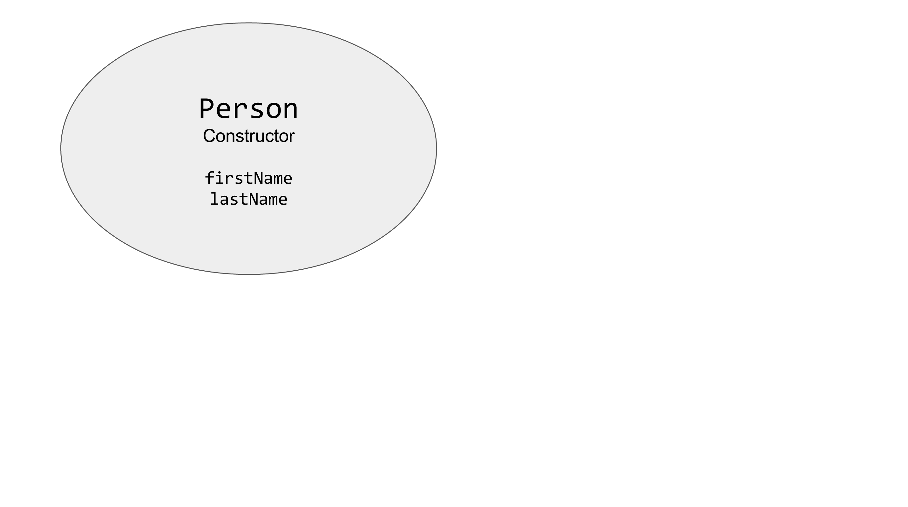

--

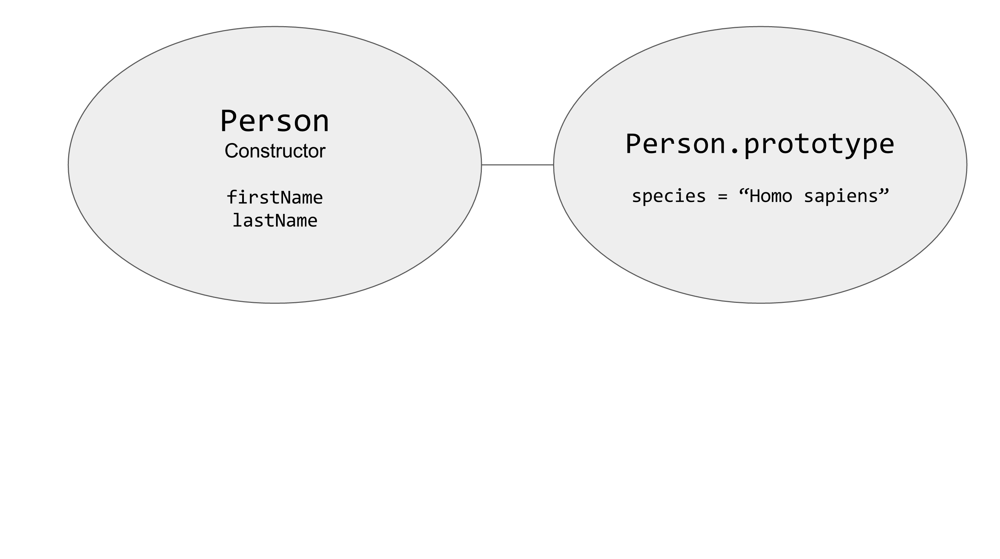

--

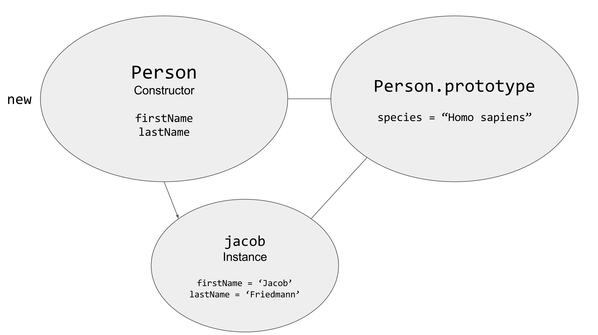

--

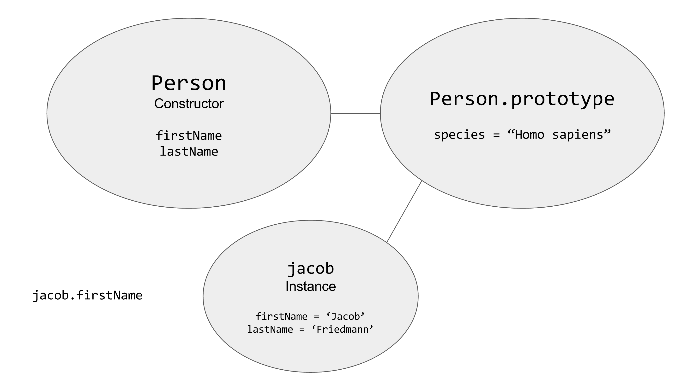

--

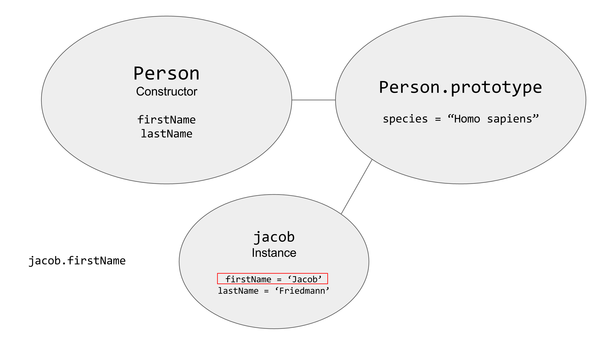

--

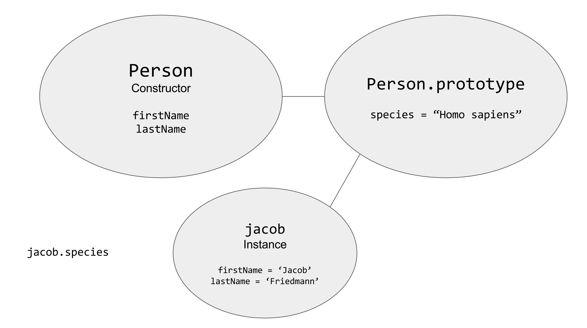

--

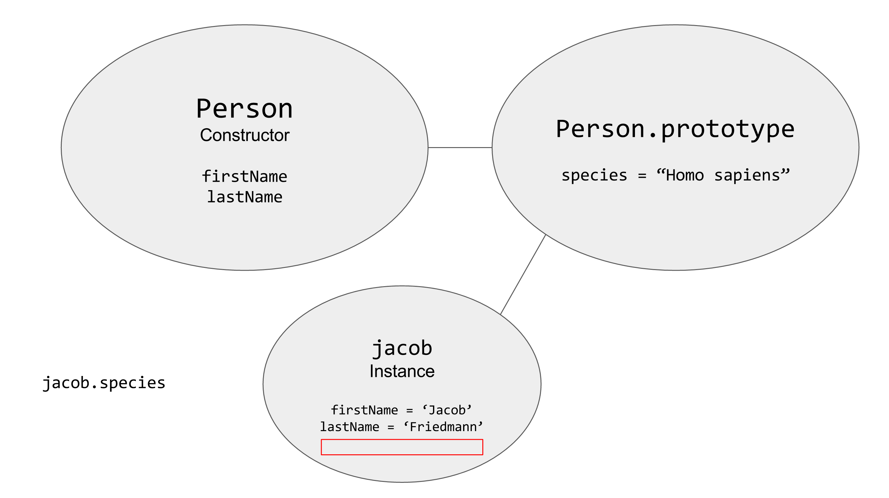

--

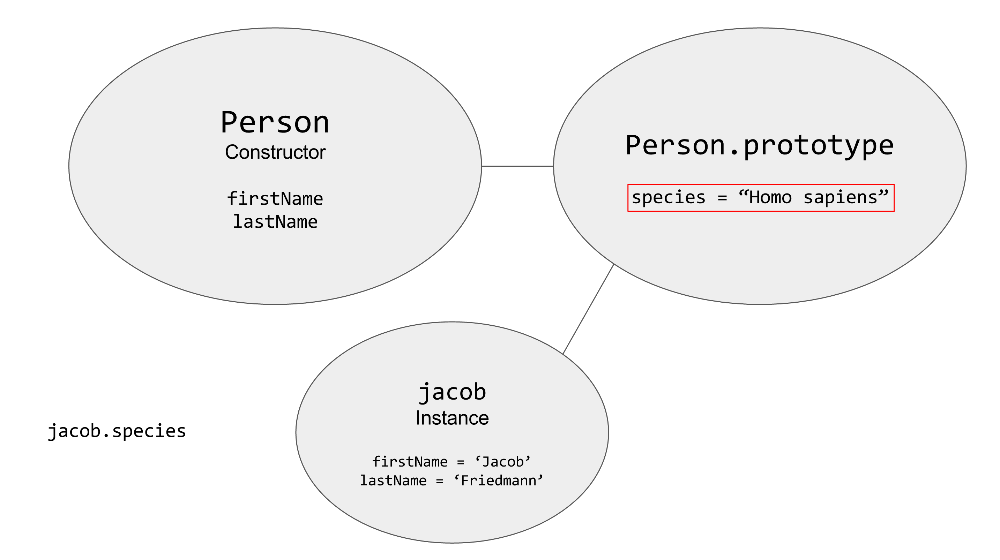

--

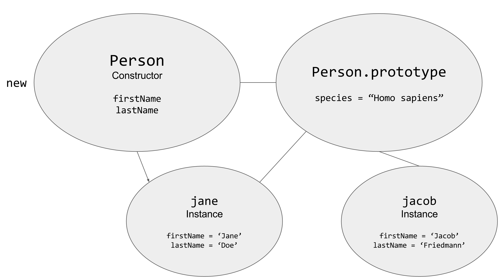

--

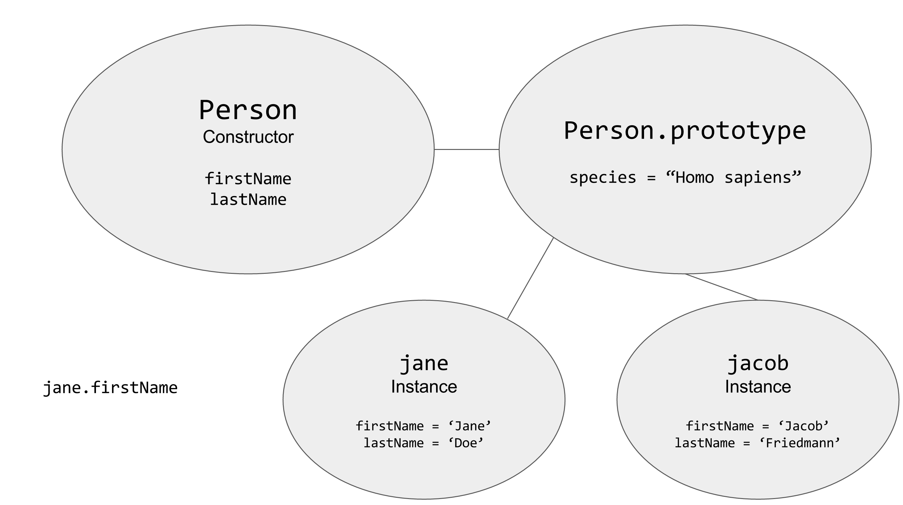

--

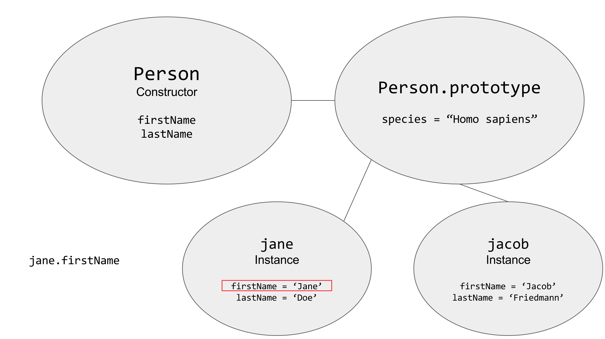

--

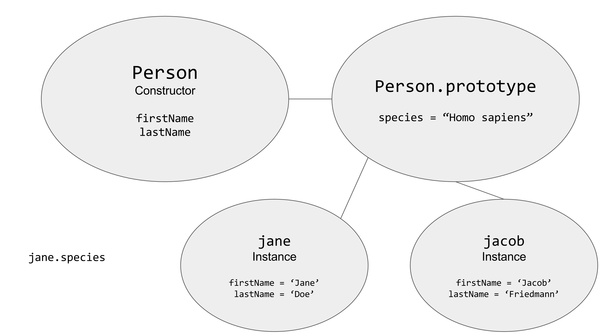

--

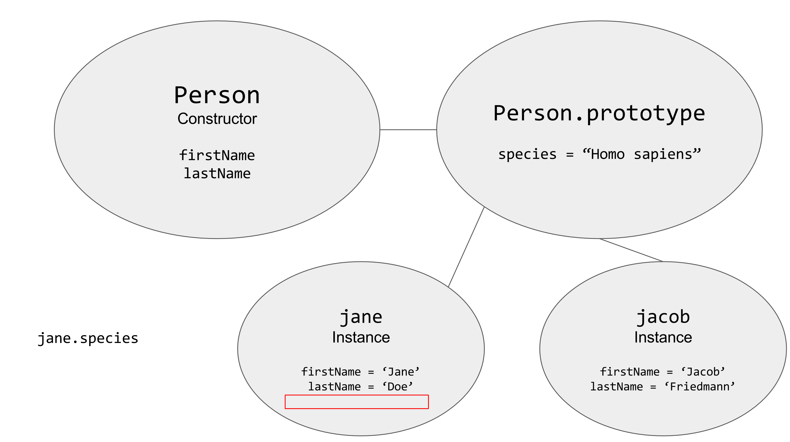

--

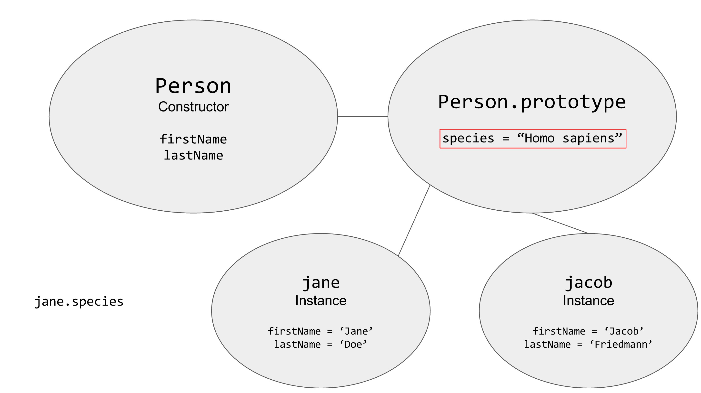

--

### Object prototypes

If something is the same in every object of a class, we can put it in the prototype instead of directly in the instance.

--

### Object prototypes

```js
// Define Class
function Person(firstName, lastName) {
  this.firstName = firstName;
  this.lastName = lastName;
}

Person.prototype.species = 'Homo sapiens';

// Create an instance
var jacob = new Person('Jacob', 'Friedmann');

console.log(jacob.firstName);
// 'Jacob'
console.log(jacob.species);
// 'Homo sapiens'
```

--

### Exercise: prototypes

Use prototypes for the part of the constructor that is same in every instance.

```js
function Car(make, model, year) {
  this.make = make;
  this.model = model;
  this.year = year;
  this.numberOfWheels = 4;
  this.description = 'a wheeled, self-powered motor vehicle used for transportation';
}
```

--

### Adding Methods, Attempt 2

Use the prototype!

```js
function Person(firstName, lastName) {
  // properties
  this.firstName = firstName;
  this.lastName = lastName;
}

// methods
Person.prototype.sayHi = function() {
  console.log('Hi, my name is ' + this.firstName + ' ' + this.lastName);
}

var jacob = new Person('Jacob', 'Friedmann');
jacob.sayHi();
// 'Hi, my name is Jacob Friedmann
```

--

### Exercise: Prototype methods

Convert the regular function that returns a plain Object to a Constructor and prototype class definition.

```js
function makeTodoList(tasks) {
  return {
    tasks: tasks,
    name: 'Todo List',
    logTasks: function() {
      this.tasks.forEach(function(task) {
        console.log(task);
      });
    },
    addTask: function(task) {
      this.tasks.push(task);
    }
  };
}
```

---

## All About `this`

What `this` means inside of a function depends on how that function was called.

--

### Rules of `this`

1. If not inside a function, `this` is the "global" object (`window`).
2. If a function call has no dot to the left, `this` is the global object (`window`).
3. If a function call has a dot to the left, `this` refers the object before the dot.
4. If inside of a constructor, called using `new`, `this` refers to the new object being created.
5. What `this` means can also be manipulated (i.e. jQuery event listeners)

--

#### 1. If not inside a function, `this` is the "global" object (`window`)

```js
console.log(this);
// window
```

--

#### 2. If a function call has no dot to the left, `this` is the global object (`window`).

```js
function logThis() {
  console.log(this);
}
logThis();
// window
```

--

#### 3. If a function call has a dot to the left, `this` refers the object before the dot.

```js
var myObj = {
  a: 4,
  b: function() {
    console.log(this);
  }
};
myObj.b();
// { a: 4, b: function() {}}
```

--

#### 4. If inside of a constructor, called using `new`, `this` refers to the new object being created.

```js
function Person(name) {
  this.name = name;
  console.log(this);
}
new Person('Jacob');
// Person { name: 'Jacob' }
```

--

#### 5. What `this` means can also be manipulated (i.e. jQuery event listeners)

We can change what `this` means inside of a function if we want:

- `bind`
- `call`
- `apply`

--

### `this` Questions

```js
var model = {
  a: 10,
  b: this
};
console.log(model.b);
```

--

```js
var person = {
  name: 'Jacob',
  logThis: function() {
    console.log(this);
  }
};
person.logThis();
```

--

```js
var person = {
  name: 'Jacob',
  logThis: function() {
    console.log(this);
  }
};
var b = person.logThis;
b();
```

--

```js
function Animal(name, sound) {
  this.name = name;
  this.sound = sound;
}
Animal.prototype.makeSound = function() {
  console.log(this.sound + '!');
}
var lion = new Animal('lion', 'rawr');
lion.makeSound();
```

--

```js
function Animal(name, sound) {
  this.name = name;
  this.sound = sound;
}
Animal.prototype.makeSound = function() {
  console.log(this.sound + '!');
}
var lion = new Animal('lion', 'rawr');
var lionMakeSound = lion.makeSound;
lionMakeSound();
```

--

```js
function Animal(name, sound) {
  this.name = name;
  this.sound = sound;
}
Animal.prototype.makeSound = function() {
  console.log(this.sound + '!');
}
var lion = new Animal('lion', 'rawr');

$.get('/animals', lion.makeSound);
```

--

### What's happeneing here?

```js
function doSomethingAsync(callback) {
  // doing something async

  callback();
}

doSomethingAsync(this.myFunc);
```

---

## Closures

Functions remember the scope in which they were created.

--

### Closures

```js
function closureExample() {
  var name = 'Jacob';

  function logName() {
    console.log(name);
  }

  logName();
}
closureExample();
```

Note:

We already know why and how this works, the `logName` function has access to the `name` variable because they are in the same local scope.

--

### Closures

```js
function closureExample() {
  var name = 'Jacob';

  function logName() {
    console.log(name);
  }
}
closureExample();
// ?
logName();
// ?
console.log(name);
// ?
```

Note:
This will not work. Both `logName` and `name` do not exist outside of the closureExample function and thus will throw errors.


--

### Closures

```js
function closureExample() {
  var name = 'Jacob';

  return function () {
    console.log(name);
  }
}

var logName = closureExample();

logName();
// ?
console.log(name);
// ?
```

Note:
Here, we can call the `logName` function since we return it from closureExample. However, we can't access the name variable since it is closed in the local scope.

--

### Closures

Closures can be used for, among other things, restricting the access to data.

--

## Closures Exercise

---

## [Exit Ticket! (Class 17)](http://goo.gl/forms/KzVZ9fuo2YYw5WIB3)

---

# Goodnight :-)
